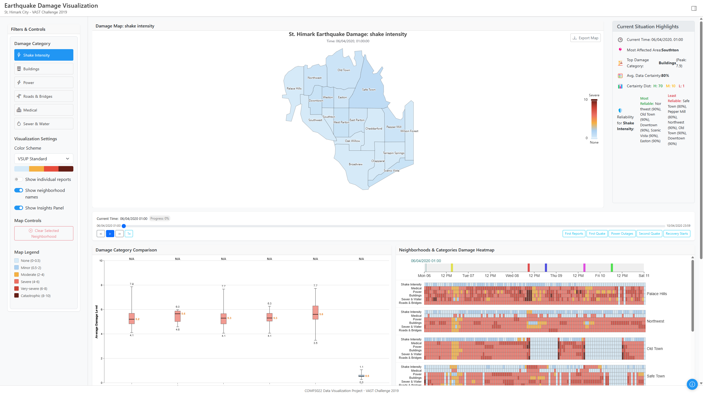
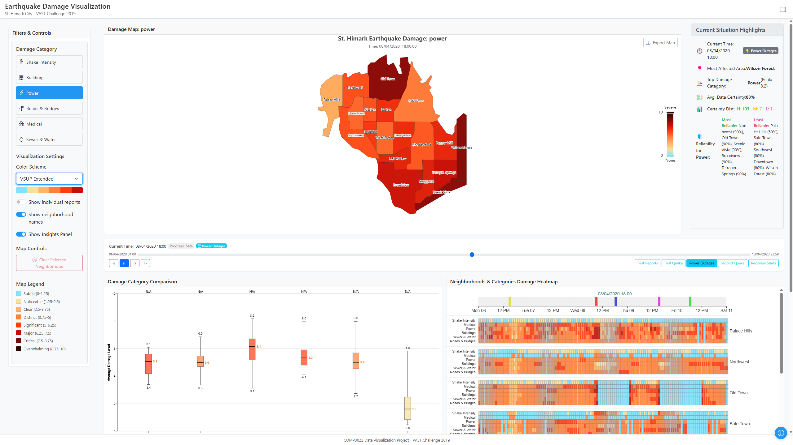
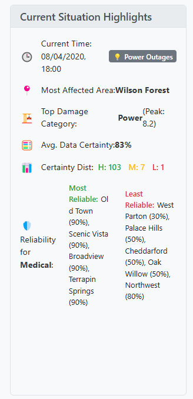

# Earthquake Damage Visualization - St. Himark (VAST Challenge 2019)

**GitHub Repository:** [https://github.com/johancilliers22/COMP3022-Data-Visualisation-Project](https://github.com/johancilliers22/COMP3022-Data-Visualisation-Project)

This project is an interactive web-based application developed as a React implementation for the VAST Challenge 2019 Mini-Challenge 1. It visualizes earthquake damage reports from the fictional city of St. Himark, enabling analysis of damage severity, uncertainty, and temporal trends to support simulated emergency response decision-making.

[](vast-mc1-vis/docs/images/dashboard-overview-initial.png)
*Fig 1: Dashboard view showing Shake Intensity map, timeline, category comparison, and heatmap.*

## 1. Project Overview

St. Himark has experienced a significant earthquake. This visualization tool processes and displays citizen-generated damage reports over time, focusing on:

*   **Damage Assessment**: Quickly understanding the severity and location of damage across various infrastructure categories.
*   **Uncertainty Visualization**: Clearly communicating the reliability of damage assessments using Bayesian statistical modeling from an offline R preprocessing pipeline. The VSUP (Value-Suppressing Uncertainty Palettes) principles are applied.
*   **Temporal Analysis**: Tracking how damage conditions and uncertainty evolve using interactive time controls.
*   **Prioritization Support**: Assisting in identifying neighborhoods and infrastructure types needing urgent attention.

## 2. Key Features

The dashboard offers a multi-faceted view of the evolving situation in St. Himark:

*   **Interactive Damage Map**:
    *   Choropleth map of St. Himark\'s 19 neighborhoods.
    *   Color-coded damage severity based on the selected category (e.g., Shake Intensity, Power, Buildings).
    *   Opacity representing data certainty (higher opacity = higher certainty).
    *   Tooltips with detailed metrics: damage level, confidence interval (CI), certainty percentage, and report count.
    *   Option to toggle neighborhood name labels.
    *   Export map as PNG.
    [](vast-mc1-vis/docs/images/dashboard-poweroutages-overview-VSUPExtended.png)
    *Fig 2: Dashboard showing Power damage selected, with corresponding map colors.*

*   **Timeline Controls**:
    *   Slider to navigate through time, updating all linked visualizations.
    *   Playback controls (play, pause, speed adjustment).
    *   Event markers indicating significant occurrences (e.g., aftershocks).

*   **Damage Category Comparison Chart**:
    *   Bar chart showing average damage levels across all categories for the selected time.
    *   Provides a quick overview of which infrastructure types are most affected.

*   **Neighborhoods & Categories Damage Heatmap**:
    *   Comprehensive heatmap displaying damage levels for every neighborhood (rows) across all damage categories (columns within each neighborhood row) over the entire event duration.
    *   Allows for identification of spatio-temporal patterns and correlations.
    [](vast-mc1-vis/docs/images/heatmap-overview.png)
    *Fig 3: Detailed heatmap view showing damage intensity patterns.*

*   **Damage Forecast Over Time Chart**:
    *   Line chart displaying historical damage trends and forecasted damage for selected areas/categories.
    *   Includes confidence bands to visualize forecast uncertainty.
    [](vast-mc1-vis/docs/images/damage-forecast.png)
    *Fig 4: Forecast chart showing damage level over time with confidence intervals.*

*   **Filter & Control Panel**:
    *   Select active damage category.
    *   Choose color schemes (including VSUP-inspired options).
    *   Toggle neighborhood labels on the map.
    *   Toggle display of the insights panel.

*   **Statistics Panel**:
    *   Displays detailed statistics for a selected neighborhood (updated on map click).

*   **Insights Panel**:
    *   Provides dynamic, textual highlights of the current situation, such as the most affected area, top damage category, data certainty, and reliability of data for different regions.
    [](vast-mc1-vis/docs/images/insights-panel.png)
    *Fig 5: Current Situation Highlights panel providing dynamic textual summaries.*

*   **Information Modal**:
    *   Accessible via an "Info" button, providing details about the visualization, data sources, how to use the tool, and how to interpret uncertainty.

## 3. Data Sources and Preprocessing

The visualization relies on data from the VAST Challenge 2019 MC1:

*   **Raw Data**:
    *   `mc1-reports-data.csv`: Citizen-generated damage reports.
    *   `neighborhoods.geojson` (or similar): Geographical boundaries for St. Himark\'s neighborhoods.
*   **R-based Preprocessing Pipeline**:
    *   A critical offline pipeline (scripts in `preprocessing/R/`) transforms raw data into analysis-ready formats.
    *   It uses **Bayesian Structural Time Series (BSTS)** modeling to quantify uncertainty and estimate damage.
    *   This pipeline generates structured CSV and JSON files (e.g., `all_summary_processed.csv`, `map_data.json`, `category_summary_aggregated.json`) in `public/data/processed/`, which are consumed by the frontend.
    *   **Benefits**: Faster load times, advanced analytics, robust uncertainty quantification, and reduced client-side processing.
    *   For more details, see the [preprocessing README](vast-mc1-vis/preprocessing/README.md) and [Data Description](vast-mc1-vis/docs/data-description.md).

## 4. Technical Stack

*   **Frontend**:
    *   **React**: JavaScript library for building the user interface.
    *   **ECharts**: For the main interactive map visualization.
    *   **Vega-Lite (via Vega-Embed)**: For the category comparison chart and the main data heatmap.
    *   **React Bootstrap**: For UI components and layout.
    *   **React Context API**: For global state management (`DataContext`, `UIContext`).
    *   **CSS**: For custom styling.
    *   **PapaParse**: For client-side CSV parsing.
*   **Offline Data Preprocessing**:
    *   **R**: Core language for statistical analysis.
    *   Key R Packages: `bsts`, `tidyverse`, `jsonlite`, `lubridate`.
*   For more details, see the [Technical Architecture](vast-mc1-vis/docs/technical-architecture.md).

## 5. Project Structure

The project is organized as follows:

*   `vast-mc1-vis/`: Root directory for the visualization application.
    *   `public/`: Static assets.
        *   `data/`: Contains raw data, GeoJSON, Vega-Lite specs, and crucially, the R-pipeline **processed data**.
            *   `processed/`: Output from the R preprocessing scripts.
            *   `specs/`: Vega-Lite JSON specifications.
    *   `src/`: React application source code.
        *   `components/`: UI and chart components.
            *   `charts/`: `EarthquakeMap.jsx`, `VegaChart.jsx`, `ForecastChart.jsx`.
            *   `ui/`: `FilterPanel.jsx`, `TimeControls.jsx`, `StatsPanel.jsx`, `InsightsPanel.jsx`, etc.
        *   `context/`: `DataContext.js` for managing data state.
        *   `hooks/`: Custom React hooks like `useDataLoader.js`, `useFilteredData.js`.
        *   `utils/`: Utility functions for data loading (`dataLoader.js`), processing (`dataProcessor.js`), uncertainty calculations (`uncertaintyCalc.js`).
        *   `App.jsx`: Main application component, defines layout and UI Context.
        *   `App.css`: Global styles.
    *   `docs/`: Detailed project documentation.
    *   `preprocessing/`: R scripts and instructions for the data preprocessing pipeline.
*   `README.md`: This file.

For a detailed breakdown, see [Component Structure](vast-mc1-vis/docs/component-structure.md).

## 6. Running the Project

### Prerequisites

*   Node.js (v14+ recommended)
*   npm or yarn
*   R (version 4.0+ recommended) for running the data preprocessing pipeline.

### Data Preprocessing (Important First Step - MUST RUN FIRST)

Before running the frontend application, you **must** run the R data preprocessing pipeline sequentially. This generates the necessary data files in `vast-mc1-vis/public/data/processed/`.

1.  **Ensure R is installed and configured.**
2.  **Navigate to the project root directory** (`vast-mc1-vis`'s parent directory) in your R environment (like RStudio or your terminal).
3.  **Run the R scripts in the following order:**
    *   **Install Packages (Run Once):** `source("vast-mc1-vis/preprocessing/R/install_packages.R")` 
    *   **Prepare Data:** `source("vast-mc1-vis/preprocessing/R/data_preparation.R")`
    *   **Run BSTS Analysis:** `source("vast-mc1-vis/preprocessing/R/analysis.R")` (Note: This step is computationally intensive and can take a significant amount of time).
    *   **Process Results:** `source("vast-mc1-vis/preprocessing/R/process.R")`

    *Alternatively, navigate to `vast-mc1-vis` root and use the provided batch/shell scripts:* `preprocessing/run_preprocessing.bat` (Windows) or `bash preprocessing/run_preprocessing.sh` (macOS/Linux), which attempt to run these R scripts in sequence.

4.  **Verify Output:** Check that files like `all_summary_processed.csv`, `map_data.json`, etc., are created in `vast-mc1-vis/public/data/processed/`.

### Frontend Application Installation

1.  Clone the repository (if you haven't already).
2.  Navigate to the `vast-mc1-vis/` directory: `cd vast-mc1-vis`
3.  Install dependencies:
    ```bash
    npm install
    ```
4.  Install performance optimizations (optional but recommended):
    ```bash
    npm run optimize
    ```

### Development Server

Run the development server:
```bash
npm start
```
The application will be available at `http://localhost:3000`.

### Building for Production

Create a production build:
```bash
npm run build
```
Or build with all optimizations applied:
```bash
npm run build:optimized
```
The production build will be in the `vast-mc1-vis/build/` folder.

## 7. Performance Optimizations

This project includes several performance optimizations:

1.  **Console Log Removal in Production**: Uses `babel-plugin-transform-remove-console`.
2.  **Data Loading Optimizations**: Relies on pre-processed data; client-side parsing of large CSVs is done efficiently.
3.  **React Optimizations**: Efficient context updates, memoization where appropriate.

For detailed information, see [Performance Optimizations Document](vast-mc1-vis/docs/performance-optimizations.md).

## 8. Documentation

This project includes comprehensive documentation in the `/docs` directory:

*   [Project Overview](vast-mc1-vis/docs/project-overview.md)
*   [Component Structure](vast-mc1-vis/docs/component-structure.md)
*   [Data Description](vast-mc1-vis/docs/data-description.md)
*   [Technical Architecture](vast-mc1-vis/docs/technical-architecture.md)
*   [Implementation Guide](vast-mc1-vis/docs/implementation-guide.md)
*   [Performance Optimizations](vast-mc1-vis/docs/performance-optimizations.md)
*   [Deployment Guide](vast-mc1-vis/docs/deployment-guide.md)
*   [Preprocessing README](vast-mc1-vis/preprocessing/README.md)

## 9. Credits

*   This project is based on the VAST Challenge 2019 Mini-Challenge 1.
*   The R preprocessing pipeline and Bayesian approach are inspired by the award-winning solution for VAST Challenge 2019 MC1 by Naeem et al. (repository: `na399/VAST-Challenge-2019-MC1`).
*   VSUP (Value-Suppressing Uncertainty Palettes): Michael Correll, Dominik Moritz, Jeffrey Heer. "Value-Suppressing Uncertainty Palettes." ACM Human Factors in Computing Systems (CHI), 2018.
*   Original VAST Challenge materials: [https://vast-challenge.github.io/2019/](https://vast-challenge.github.io/2019/)

---

This README provides an overview of the Earthquake Damage Visualization project. For more specific details, please refer to the linked documentation files.
