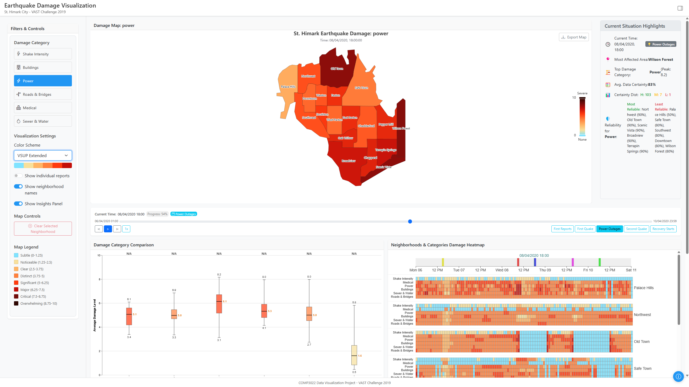
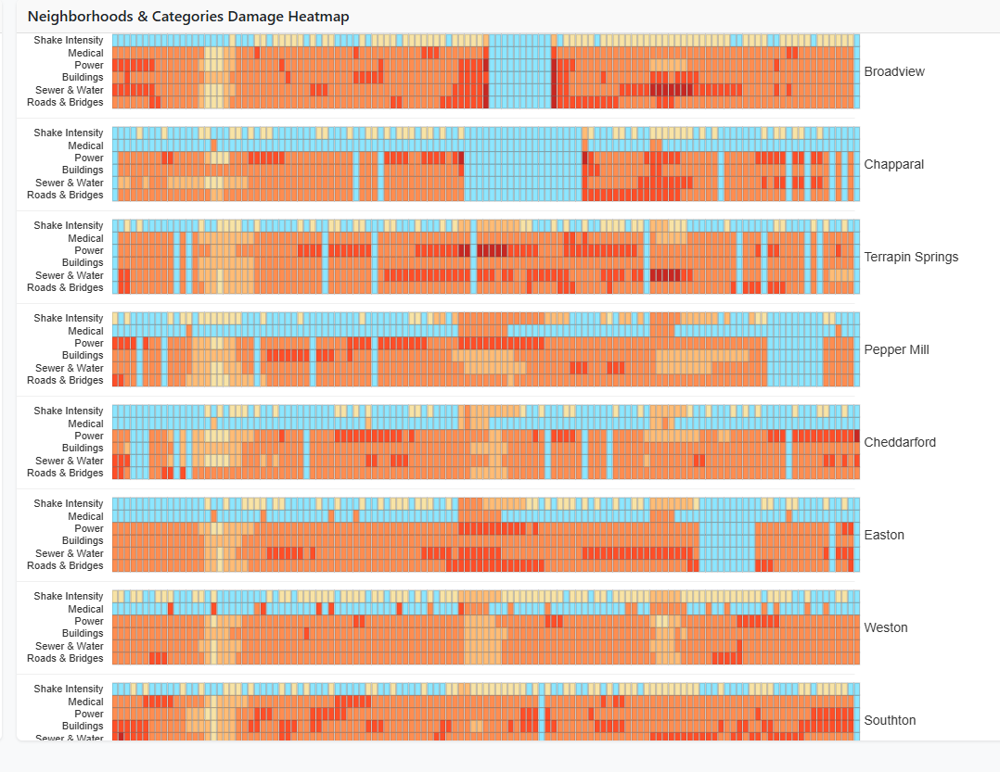
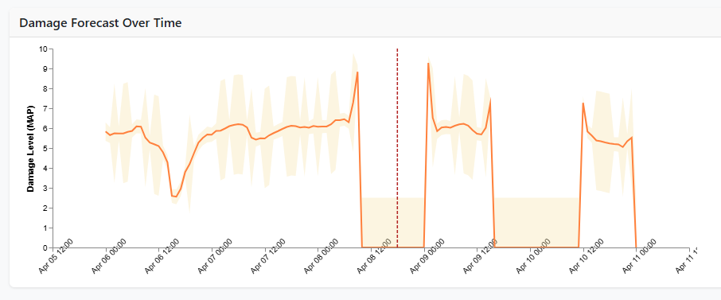
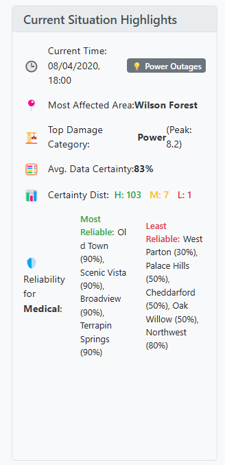

# Visual Analytics for Earthquake Damage in St. Himark: A COMP3022 Report

**Group Name/Number:** `[Insert Group Name/Number]`
**Date:** 7 May 2025
**Authors:** `[Insert Author Names, e.g., Student Name 1 (ID: 123456), Student Name 2 (ID: 654321), ...]`

**GitHub Repository:** `[Insert GitHub Repository URL, e.g., https://github.com/user/repo]`
**Live Application URL:** `[Insert Live Application URL (e.g., GitHub Pages, Vercel) or N/A]`
**Key Runtime Requirements:** `Node.js (v14+ recommended), R (version 4.0+ for preprocessing), Modern Web Browser (Chrome, Firefox)`

---

**Abstract:** `[A brief (150-250 words) summary of the project, including the problem addressed, methods used, key findings, and the main contributions of your visualization tool. This should provide a concise overview of the entire report.]`

---

## Table of Contents
1.  [Introduction](#1-introduction)
2.  [Methods and Design](#2-methods-and-design)
    1.  [Problem Definition and Goals](#21-problem-definition-and-goals)
    2.  [Data Acquisition and Preprocessing](#22-data-acquisition-and-preprocessing)
    3.  [Visualisation Design Rationale](#23-visualisation-design-rationale)
    4.  [System Interface Design](#24-system-interface-design)
3.  [Tool and Implementation](#3-tool-and-implementation)
    1.  [System Architecture](#31-system-architecture)
    2.  [Visual Components and Features](#32-visual-components-and-features)
    3.  [Interactive Features](#33-interactive-features)
    4.  [Technologies, Tools, and Libraries](#34-technologies-tools-and-libraries)
4.  [Results: Answering the Analysis Tasks](#4-results-answering-the-analysis-tasks)
    1.  [Task 1: Emergency Response Prioritisation](#41-task-1-emergency-response-prioritisation)
    2.  [Task 2: Uncertainty and Reliability of Reports](#42-task-2-uncertainty-and-reliability-of-reports)
    3.  [Task 3: Changes in Conditions and Uncertainty Over Time](#43-task-3-changes-in-conditions-and-uncertainty-over-time)
5.  [Reflection and Future Work](#5-reflection-and-future-work)
    1.  [Project Reflection](#51-project-reflection)
    2.  [Limitations and Future Work](#52-limitations-and-future-work)
6.  [Conclusion](#6-conclusion)
7.  [References](#7-references)
8.  [Appendix (Optional)](#8-appendix-optional)
    1.  [Instructions to Run the Tool](#81-instructions-to-run-the-tool)
    2.  [External Libraries and Configurations](#82-external-libraries-and-configurations)
    3.  [Detailed File Structure](#83-detailed-file-structure)
    4.  [Group Member Contributions (to be submitted separately)]()

---

## 1. Introduction

This project, a term-time assessment for the COMP3022 Data Visualization module, addresses the VAST Challenge 2019 Mini-Challenge 1. The scenario involves St. Himark, a fictional city struck by a significant earthquake. Emergency responders grapple with assessing damage and allocating resources based on citizen-generated reports and seismic data. These reports, submitted via a mobile app, provide subjective damage intensity ratings (scale 0-10) for categories like Shake Intensity, Buildings, Medical Facilities, Power, Roads & Bridges, and Sewer & Water Systems. The data arrives chronologically, posing challenges related to volume, reliability (uncertainty), and identifying evolving patterns.

*   **Background:** The VAST Challenge 2019 Mini-Challenge 1 scenario: St. Himark has been hit by an earthquake. Officials initially use seismic readings but need more comprehensive information from citizen damage reports to understand the true conditions and prioritize response effectively. The city had presciently released a damage reporting mobile app, enabling citizens to provide timely updates.
    *   Cite the VAST Challenge website: [VAST Challenge 2019](https://vast-challenge.github.io/2019/)
*   **Problem Statement:** The core challenge is to develop an interactive web-based visual analytics tool. This tool must aid emergency responders in synthesizing seismic data (shake maps from April 6 and April 8) with app-based citizen damage reports and background city knowledge. The goal is to triage rescue and recovery efforts effectively by moving beyond initial shake map assessments to a more nuanced, data-driven understanding of the disaster's impact.
*   **Project Goals & Objectives:** The primary objective is to develop an interactive visualization tool that supports emergency response decision-making. This tool aims to:
    1.  **Damage Assessment (Task 1):** Enable users to quickly assess the severity and spatial distribution of damage across various infrastructure categories, thereby identifying the hardest-hit neighborhoods and prioritizing response.
    2.  **Uncertainty Visualization (Task 2):** Clearly communicate the reliability and uncertainty associated with damage assessments. This involves leveraging Bayesian statistical modeling (performed during offline R preprocessing) and applying principles like Value-Suppressing Uncertainty Palettes (VSUPs) to help users compare the reliability of reports from different neighborhoods.
    3.  **Temporal Analysis (Task 3):** Allow users to track how damage conditions and the associated uncertainty evolve over the course of the event using interactive time controls, and to describe these key changes.
    4.  **Insight Generation:** Facilitate the discovery of patterns, anomalies, and correlations within the data, such as identifying specific time periods of high uncertainty or neighborhoods with sparse reporting.
*   **Report Structure:** This report details the development and application of our visual analytics solution. Section 2 outlines the methods and design, including data preprocessing and visualization rationale. Section 3 describes the tool's implementation, architecture, and features. Section 4 presents the results, directly addressing the three analysis tasks. Section 5 reflects on the project and discusses future work. Finally, Section 6 concludes the report, followed by references and an appendix with supplementary information.

---

## 2. Methods and Design

This section details the methodologies employed for data processing, the algorithms used for analysis, and the rationale behind the design choices for the visualisation and user interface.

### 2.1 Problem Definition and Goals
*   **Recap of VAST MC1 Challenge:** St. Himark faces an earthquake disaster. Emergency services, stretched thin, rely on citizen-provided information via a new mobile app to focus recovery efforts. The challenge is to combine seismic readings, app responses, and city knowledge to help triage rescue and recovery.
*   **Specific Aims for this Project (Analysis Tasks):** Our visual analytics tool is designed to directly address the three core analysis tasks of MC1:
    *   **Task 1 (Emergency Response Prioritisation):** "Emergency responders will base their initial response on the earthquake shake map. Use visual analytics to determine how their response should change based on damage reports from citizens on the ground. How would you prioritize neighborhoods for response? Which parts of the city are hardest hit?"
    *   **Task 2 (Uncertainty and Reliability):** "Use visual analytics to show uncertainty in the data. Compare the reliability of neighborhood reports. Which neighborhoods are providing reliable reports? Provide a rationale for your response."
    *   **Task 3 (Change Over Time):** "How do conditions change over time? How does uncertainty in change over time? Describe the key changes you see."
*   **Key Analytical Questions Addressed:** Beyond the core tasks, the tool aims to help answer questions such as:
    *   Which neighborhoods consistently report the most severe damage across critical categories?
    *   How confident can we be in the damage assessment for a specific neighborhood and category at a given time?
    *   Are there specific time periods where uncertainty is particularly high or low?
    *   Which infrastructure types suffer the most widespread or severe damage?
    *   How does the situation change immediately following recorded earthquake aftershocks (if discernible from data)?
    *   Are there neighborhoods with consistently sparse reporting for certain damage types, and how is this represented?
*   **Overall Approach:** Our solution integrates multiple coordinated views built with modern web technologies (React, ECharts, Vega-Lite). It relies heavily on data pre-processed using an offline R pipeline featuring Bayesian Structural Time Series (BSTS) modeling to provide robust estimates of damage severity (Maximum A Posteriori - MAP) and quantify uncertainty (e.g., Credible Interval Range - CIR).

### 2.2 Data Acquisition and Preprocessing
*   **Data Sources:**
    *   The project utilizes the datasets provided by VAST Challenge 2019 MC1:
        *   `mc1-reports-data.csv`: Contains citizen-generated damage reports with fields: `time`, `location` (neighborhood ID), `category` (e.g., Shake Intensity, Buildings, Medical, Power, Roads & Bridges, Sewer & Water), and `value` (damage rating 0-10).
        *   `neighborhoods.geojson` (or `neighborhoods_geojson.json`): Geographical boundary data for St. Himark's 19 neighborhoods, essential for map-based visualizations.
        *   Shake Maps (April 6 and April 8): Provided as baseline seismic intensity data.
    *   Detailed descriptions of these datasets are available in `docs/data-description.md`.
*   **R Preprocessing Pipeline:** A critical offline R pipeline (scripts in `preprocessing/R/`) is implemented to transform raw data into analysis-ready formats suitable for efficient frontend consumption. This pipeline consists of several stages:
    *   **Package Installation (`install_packages.R`):** Ensures all necessary R packages (e.g., `tidyverse`, `bsts`, `jsonlite`, `zoo`, `lubridate`, `future`) are available.
    *   **Initial Data Preparation (`data_preparation.R`):** Performs initial cleaning of `mc1-reports-data.csv` (e.g., parsing timestamps, ensuring consistent neighborhood/category naming) and converts the data into a long format (`mc1-reports-data-long.csv`) suitable for time series analysis.
    *   **BSTS Modeling (`analysis.R`):**
        *   This is the core analytical step. It applies Bayesian Structural Time Series (BSTS) modeling to generate robust time series estimates of damage and associated uncertainty for each neighborhood-category pair.
        *   A rule is implemented to model only location-category pairs with a sufficient number of reports (e.g., >= 5 reports) to ensure model stability; sparse pairs are handled later.
        *   The script outputs detailed results from each BSTS model and a combined CSV (`all_bsts_results.csv`) containing MAP estimates and credible intervals (e.g., 95% CI).
        *   Parallel processing (via the `future` package) is utilized to improve the efficiency of running numerous BSTS models.
    *   **Post-Processing and Aggregation (`process.R`):**
        *   Consumes `all_bsts_results.csv`.
        *   Generates a complete time series at regular intervals (e.g., every 5 minutes) for all 19 neighborhoods x 6 damage categories. This ensures a consistent temporal backbone for visualizations.
        *   For time steps between actual BSTS model updates (which occur when new data significantly changes the model), Last Observation Carried Forward (LOCF) is applied using the `zoo` package. This propagates the last known modeled state until a new update occurs.
        *   Crucially, for location-category pairs that were too sparse for BSTS modeling (i.e., not present in `all_bsts_results.csv`), placeholder data is generated (e.g., damage value of 0, default high uncertainty/low certainty). This explicit handling of data sparsity is vital for accurate representation.
        *   Creates aggregated summary files like `all_summary_aggregated.csv` (potentially daily/hourly summaries) and `category_summary_aggregated.json` (summaries per category over time).
        *   Generates frontend-optimized data structures, such as `map_data.json` (containing hourly slices of MAP and uncertainty for each neighborhood-category, suitable for the interactive map) and `frontend_data.json` or `all_summary_processed.csv` (a comprehensive dataset for detailed charts like the heatmap).
*   **Benefits of Offline Preprocessing:** This extensive offline pipeline provides faster load times for the frontend, enables the use of sophisticated statistical models like BSTS, ensures robust uncertainty quantification, and significantly reduces client-side processing demands.
*   **Handling Sparsity and Uncertainty Quantification:**
    *   The BSTS models inherently provide MAP estimates and credible intervals (CIs), which are direct measures of value and uncertainty.
    *   The preprocessing pipeline and subsequent frontend utilities (`src/utils/uncertaintyCalc.js`) convert these metrics into consistent `certainty` scores (e.g., 0-1 range) for visual encoding (like opacity on the map). Functions like `calculateCertaintyFromCIR` or `calculateCertaintyFromCIWidth` might be used.
    *   Instances with insufficient data for BSTS modeling are explicitly represented with a low damage value (e.g., 0) and low certainty, ensuring they are not misinterpreted as having no reports or no damage if data is simply missing.

### 2.3 Visualisation Design Rationale
*   **Guiding Principles:**
    *   The design adheres to Shneiderman's mantra: "Overview first, zoom and filter, then details-on-demand," facilitating progressive data exploration from city-wide patterns to neighborhood-specific details.
    *   Munzner's nested model for visualization design and validation guided the process of defining domain problems, abstracting tasks, designing visual encodings, and implementing algorithms.
    *   A user-centered approach targets emergency planners and responders, prioritizing clarity, intuitiveness, and actionable insights under time pressure.
    *   Inspiration was drawn from effective uncertainty visualization practices, such as Value-Suppressing Uncertainty Palettes (VSUPs) by Correll et al. (2018), to ensure that uncertainty is an integral part of the visual narrative.
*   **Choice of Visual Encodings:**
    *   **Damage Level (MAP estimate):** Encoded using color intensity on the choropleth map (e.g., sequential color schemes like Viridis or BrewerYlOrRd, where darker/more intense colors indicate higher damage) and position/height in bar charts or line charts.
    *   **Uncertainty (Credible Interval width, Certainty Score):**
        *   On the map: Encoded using opacity (higher opacity for higher certainty/narrower CI), or as part of a bivariate color scheme where color lightness might vary with uncertainty. Explicit CI ranges and derived certainty percentages are provided in tooltips.
        *   In Forecast Line Charts: Represented by shaded bands (width corresponding to CI) around the MAP estimate line.
        *   In Bar Charts/Boxplots: Error bars or the interquartile range of boxplots can indicate the spread or uncertainty of reported/modeled values.
    *   **Report Count:** Displayed in tooltips to provide context on data density for a given region/category.
    *   **Time:** Mapped to the x-axis of time series charts and interactively controlled via a timeline slider.
    *   **Categorical Data (Damage Types, Neighborhoods):** Represented using distinct color schemes (where appropriate and limited to avoid visual clutter, e.g., for different lines in a multi-series chart if not too many), spatial separation (e.g., small multiples, or distinct rows/columns in heatmaps), or as axes labels.
    *   **Map Color Palette Rationale:** `[The choice of color palette for the map aims for perceptual clarity and effectiveness. For damage severity, a sequential scheme (e.g., yellow-orange-red) is used, which is generally good for ordered data. For uncertainty, opacity is the primary visual variable: areas with higher certainty (narrower CIs, more reliable data) are more opaque, while areas with lower certainty are more transparent (value-suppressing). This ensures that users are less likely to draw strong conclusions from uncertain data. If a bivariate scheme is explored, it would combine a sequential color for damage with a lightness/saturation variation for uncertainty. Color-blind friendliness should be considered in palette selection, referring to tools like ColorBrewer.]`
*   **Rationale for Each Chart/View (and how they address analytical tasks):**
    *   **Interactive Damage Map (`EarthquakeMap.jsx`):** (Addresses Tasks 1 & 2)
        *   Provides the primary spatial overview of damage severity and uncertainty across St. Himark's 19 neighborhoods.
        *   Uses choropleth encoding for damage (color intensity) and uncertainty (opacity).
        *   Tooltips offer detailed metrics (damage value, CI, certainty score, report count).
        *   Allows users to quickly identify hotspots, compare regions, and understand the spatial distribution of reliable vs. unreliable information.
    *   **Timeline Controls & Event Markers (`TimeControls.jsx`):** (Addresses Task 3)
        *   Enables users to navigate through time, updating all linked visualizations dynamically.
        *   Playback controls allow for animated temporal exploration.
        *   Event markers (if data supports, e.g., for aftershocks) highlight significant occurrences.
    *   **Damage Category Comparison Chart (Bar Chart, via `VegaChart.jsx`):** (Addresses Tasks 1 & 3)
        *   Displays average damage levels across all infrastructure categories for the selected time point.
        *   Helps identify which types of infrastructure are most affected city-wide or within a selected region, and how this profile changes over time.
    *   **Neighborhoods & Categories Damage Heatmap (`VegaChart.jsx`):** (Addresses Tasks 1 & 3)
        *   Offers a dense, matrix-like overview of damage levels for every neighborhood (rows) across all damage categories (columns) over the entire event duration (or selected time window).
        *   Facilitates the identification of spatio-temporal patterns, correlations (e.g., if power outages consistently co-occur with communication issues in certain areas), and areas with persistently high damage in specific categories. Areas with insufficient data for BSTS modeling are shown with zero modeled damage to reflect sparsity.
    *   **Damage Forecast Over Time Chart (`ForecastChart.jsx` or similar ECharts line chart):** (Addresses Tasks 2 & 3)
        *   Displays historical damage trends (MAP estimates) and, if applicable, forecasted damage for selected neighborhoods/categories.
        *   Crucially includes confidence bands (CIs) to visualize the uncertainty associated with these estimates and forecasts over time.
    *   **Insights Panel (`InsightsPanel.jsx`):** (Addresses Tasks 1, 2, & 3)
        *   Provides dynamic, textual summaries and highlights of the current situation based on filtered data and selected time (e.g., most affected area, top damage category, overall data certainty levels).
        *   Aids in quick interpretation and decision-making by flagging critical information.
*   **Coordination and Linking:** All views are tightly coupled. Selecting a time on the timeline updates the map, bar charts, and heatmap. Clicking a neighborhood on the map filters the forecast chart and updates the statistics panel. This synchronized interaction model is crucial for integrated multi-faceted analysis, allowing users to seamlessly explore relationships between spatial, temporal, and categorical aspects of the data.

### 2.4 System Interface Design
*   **Overall Layout and Structure:** `[Describe the dashboard layout: e.g., a main map view, with temporal controls at the bottom, filter panels on a side, and supplementary charts/panels arranged logically around the map. Justify this arrangement for workflow, e.g., map as a central focus for spatial tasks, filters easily accessible, temporal context always visible.]`
    *   **Visual Justification of Layout:** `[Placeholder for Full Dashboard Screenshot/Wireframe with Annotations Explaining Layout and Navigation Flow. This visual should illustrate how a user might typically interact with the tool, moving from overview (map, timeline) to detailed views (forecast chart, stats panel) guided by filters and selections.]`
    *   Refer to `docs/component-structure.md` for a detailed breakdown of individual components if not fully covered by the visual justification.
*   **Interactivity and User Controls:** Users can interact via:
    *   **Time Navigation:** Timeline slider, play/pause/speed controls.
    *   **Category Selection:** Dropdown or radio buttons to select the primary damage category for the map and other views.
    *   **Map Interaction:** Clicking on neighborhoods to select them for detailed views (stats panel, forecast chart), zooming/panning.
    *   **Chart Interaction:** Hovering for tooltips, potentially brushing or clicking on bars/heatmap cells for cross-filtering (if implemented).
    *   **Control Panel Toggles:** Show/hide neighborhood labels, switch color schemes, open information modals.
    *   These controls empower users to tailor the views to their specific analytical questions and explore the dataset dynamically.
*   **Narrative and Storytelling (if applicable):** `[If the tool includes features for annotation, saving states, or guided tours, describe them here. Otherwise, state that the primary mode of use is exploratory data analysis driven by the user.]`

---

## 3. Tool and Implementation

This section describes the technical architecture of the visualisation application, details of its visual components and their implementation, interactive features, and the technologies, tools, and libraries used.

### 3.1 System Architecture
*   **Frontend Framework/Library:** The application is a single-page application (SPA) built using **React** (version `[Specify React version, e.g., 18.2.0]`). React was chosen for its component-based architecture, efficient virtual DOM rendering, strong ecosystem, and suitability for developing complex interactive user interfaces.
*   **Component-Based Structure:** The UI is modularized into reusable React components, primarily located in `src/components/`. This promotes separation of concerns, maintainability, and testability. Key component categories include:
    *   `charts/`: Contains components responsible for rendering specific visualizations, e.g., `EarthquakeMap.jsx` (ECharts-based map), `VegaChart.jsx` (a generic wrapper for Vega-Lite charts like the heatmap and category comparison), `ForecastChart.jsx` (ECharts-based line chart for time series).
    *   `ui/`: Houses general UI elements like `FilterPanel.jsx`, `TimeControls.jsx`, `StatsPanel.jsx`, `InsightsPanel.jsx`, and `InfoModal.jsx`.
    *   A detailed breakdown of components and their hierarchy can be found in `docs/component-structure.md`.
*   **State Management:**
    *   Global application state is managed using **React Context API**. Two primary contexts are used:
        *   `DataContext` (defined in `src/context/DataContext.js`): Responsible for fetching, storing, and providing all static and pre-processed data (GeoJSON, neighborhood maps, aggregated summaries, and potentially the large `all_summary_processed.csv`). It also manages loading and error states for this initial data load. Components access this via a `useData()` hook.
        *   `UIContext` (typically defined within `App.jsx` and provided globally): Manages UI-related state such as the currently selected time (`currentTime`), selected damage category (`selectedCategory`), selected neighborhood (`selectedNeighborhood`), active color scheme, and other filter settings. Components access this via a `useUI()` hook.
    *   This approach centralizes state logic and avoids excessive prop-drilling, ensuring data consistency across disparate components.
*   **Data Handling and Flow:**
    *   **Initial Load:** Upon application startup, `DataContext` (via `utils/dataLoader.js` and its `loadAllData` function) fetches essential static files (GeoJSON, pre-calculated summaries like `category_summary_aggregated.json`) and the comprehensive time-series data (`all_summary_processed.csv`).
    *   **Dynamic Data for Map:** The `EarthquakeMap.jsx` component dynamically fetches hourly slices of BSTS model outputs (MAP and uncertainty metrics) from `map_data.json` (via `loadAllBSTSData` in `dataLoader.js`). This fetch is triggered by changes in `currentTime` (snapped to the hour) or `selectedCategory` from `UIContext`. Caching is implemented in `loadAllBSTSData` to avoid redundant fetches.
    *   **Data for Other Charts:** Components like `VegaChart.jsx` (for heatmap) typically consume data from `all_summary_processed.csv` (provided by `DataContext`), potentially applying filters based on `UIContext` state (e.g., `currentTime`) either within the component or via signals in the Vega-Lite spec.
    *   Client-side data transformation is minimized due to the extensive R preprocessing. Utilities in `src/utils/` (e.g., `dataProcessor.js`, `uncertaintyCalc.js`) primarily handle formatting for specific libraries or deriving display-friendly metrics (like certainty scores).
*   **Performance Optimizations:**
    *   The most significant performance optimization is the **offline R data preprocessing pipeline**, which pre-computes complex statistical models and aggregates data, vastly reducing client-side computation.
    *   Dynamic loading of map data slices (`map_data.json`) ensures that only necessary data for the current map view is fetched.
    *   Memoization (`React.memo`, `useMemo`) is applied to components and expensive calculations where appropriate to prevent unnecessary re-renders.
    *   The build process includes `babel-plugin-transform-remove-console` to strip console logs from production builds. For detailed information, see `docs/performance-optimizations.md`.
*   **Backend:** The application is designed as a static web application. There is no active backend for dynamic data processing; it serves pre-built static assets (HTML, CSS, JS, and pre-processed data files). This makes it suitable for deployment on any static hosting platform.

### 3.2 Visual Components and Features
(This section provides detailed descriptions of each visual component, their implementation, and links to coursework requirements.)

*   **Interactive Damage Map (`EarthquakeMap.jsx`):**
    *   **Implementation:** Uses the ECharts library. It registers GeoJSON for St. Himark neighborhoods and dynamically styles each neighborhood based on processed BSTS data for the selected category and time.
    *   **Data Source & Processing:** Fetches hourly data slices from `map_data.json` via `loadAllBSTSData`. The `processNeighborhoodsData` internal function maps this data to GeoJSON features, calculates damage color based on the selected `activeColorSchemePalette` via ECharts `visualMap`, and sets opacity based on `certainty` derived by `uncertaintyCalc.js` utils.
    *   **Key Features & Task Relevance:** Addresses **Task 1** (spatial prioritization, identifying hard-hit areas) and **Task 2** (visualizing uncertainty via opacity and tooltips). Tooltips display MAP damage value, CI bounds, certainty percentage, and report count. Map export to PNG is supported.
    *   
        *Fig X: Map view showing Shake Intensity for St. Himark neighborhoods (Damage value encoded by color, uncertainty by opacity).*
    *   
        *Fig Y: Map showing Power damage, illustrating the VSUP-inspired uncertainty encoding through opacity.*

*   **Timeline Controls (`TimeControls.jsx`):**
    *   **Implementation:** A custom React component using HTML range inputs for the slider and standard buttons for playback, integrated with `UIContext` to update `currentTime`.
    *   **Key Features & Task Relevance:** Essential for **Task 3** (analyzing changes over time). Drives temporal updates across all linked visualizations.

*   **Damage Category Comparison Chart (`VegaChart.jsx` configured for bar chart):**
    *   **Implementation:** A generic `VegaChart.jsx` component that embeds Vega-Lite visualizations. For this chart, it loads `public/data/specs/category-comparison-spec.json`.
    *   **Data Source & Processing:** The Vega-Lite spec likely references `public/data/processed/category_summary_aggregated.json` or the component passes this data (from `DataContext`) to the Vega view. Filters based on `currentTime` from `UIContext` are applied via Vega signals or pre-filtering.
    *   **Key Features & Task Relevance:** Supports **Task 1** (identifying most affected infrastructure types) and **Task 3** (seeing how this profile changes over time).

*   **Neighborhoods & Categories Damage Heatmap (`VegaChart.jsx` configured for heatmap):**
    *   **Implementation:** Uses `VegaChart.jsx` loading `public/data/specs/heatmap-all-neighborhoods-spec.json`.
    *   **Data Source & Processing:** Consumes data derived from `all_summary_processed.csv` (via `DataContext`). The Vega-Lite spec or the component filters/aggregates this data based on the selected time window to display damage values for each neighborhood-category cell. Cells representing insufficient data (handled in R preprocessing as 0 damage/low certainty) are visually distinct.
    *   **Key Features & Task Relevance:** Addresses **Task 1** and **Task 3** by providing a dense overview of damage across all neighborhoods and categories over time, revealing spatio-temporal patterns.
    *   
        *Fig Z: Detailed heatmap view showing damage intensity patterns across neighborhoods and categories.*

*   **Damage Forecast Over Time Chart (`ForecastChart.jsx` or similar ECharts component):**
    *   **Implementation:** Likely an ECharts line chart component.
    *   **Data Source & Processing:** Uses time-series data from `all_summary_processed.csv` (via `DataContext`), filtered for a selected neighborhood and category (from `UIContext`). Displays historical MAP estimates and shaded credible intervals.
    *   **Key Features & Task Relevance:** Directly addresses **Task 3** (change in conditions and uncertainty over time) and **Task 2** (visualizing uncertainty trends).
    *   
        *Fig W: Forecast chart showing damage level (MAP) over time with 95% Credible Intervals (CI) for a selected entity.*

*   **Filter & Control Panel (`FilterPanel.jsx`):**
    *   **Implementation:** Custom React component with selectors (e.g., `CategorySelector`, `ColorSchemeSelector` from `ui/selectors`) that update `UIContext`.
    *   **Key Features & Task Relevance:** Allows user-driven exploration, crucial for all tasks.

*   **Statistics Panel (`StatsPanel.jsx`):**
    *   **Implementation:** Custom React component displaying detailed metrics for a neighborhood selected on the map (via `UIContext`).
    *   **Key Features & Task Relevance:** Provides details-on-demand for **Task 1** and **Task 2**.

*   **Insights Panel (`InsightsPanel.jsx`):**
    *   **Implementation:** Custom React component generating textual summaries based on current data in `DataContext` and `UIContext`.
    *   **Key Features & Task Relevance:** Offers quick takeaways, supporting rapid assessment for all tasks.
    *   
        *Fig V: Insights Panel providing dynamic textual summaries.*

*   **Information Modal (`InfoModal.jsx`):**
    *   **Implementation:** React Bootstrap modal component providing help text.
    *   **Key Features & Task Relevance:** Enhances usability by explaining features and uncertainty interpretation.

### 3.3 Interactive Features
(Summarized from README and implementation guide)
*   **Selection and Highlighting:** Clicking a neighborhood on the map selects it, highlighting it and updating dependent views (Stats Panel, Forecast Chart). Other interactive elements might use hover highlighting.
*   **Brushing and Linking:** All primary visual components are linked through the `UIContext` and `DataContext`. Changes in the `TimeControls.jsx` (timeline slider) update all views to reflect the selected `currentTime`. Selections in `FilterPanel.jsx` (e.g., `selectedCategory`) also propagate globally.
*   **Tooltips:** Provide rich, context-sensitive information on hover for map neighborhoods (damage, CI, certainty, report count) and potentially for elements in other charts.
*   **Filtering:** Primarily driven by the `FilterPanel.jsx` for damage category and `TimeControls.jsx` for the temporal window. These filters dynamically update the data presented in all relevant views.
*   **Zooming and Panning:** Supported by the ECharts map for spatial exploration.
*   **Animation (Time Playback):** The timeline controls allow for animated playback, enabling users to observe temporal trends dynamically across the dashboard.

### 3.4 Technologies, Tools, and Libraries
*   **Core Frontend:**
    *   **JavaScript (ES6+)**
    *   **React** (version `[Specify from your project, e.g., 18.2.0]`)
    *   **HTML5, CSS3**
*   **Visualisation Libraries:**
    *   **ECharts** (version `[e.g., ^5.4.0]`): Chosen for its powerful and flexible map component (GeoJSON rendering, `visualMap` for dynamic styling, tooltips, export) and line chart capabilities (`ForecastChart.jsx`).
    *   **Vega-Lite** (version `[e.g., ^5.5.0]`, via **Vega-Embed** `[e.g., ^6.20.8]`): Used for the category comparison bar chart and the main data heatmap (`VegaChart.jsx`). Its declarative grammar facilitates concise specification of complex statistical graphics and linking via signals.
*   **Data Handling/Parsing:**
    *   **PapaParse** (version `[e.g., ^5.3.2]`): For efficient client-side parsing of large CSV files (e.g., `all_summary_processed.csv`).
    *   Native Fetch API / Axios: For loading GeoJSON, Vega-Lite JSON specifications, and other JSON data files.
*   **Styling & UI Components:**
    *   **React Bootstrap** (version `[e.g., ^2.7.0]`): For layout components (Grid, Stack), modals, buttons, and responsive design utilities.
    *   Custom CSS (`App.css`, component-specific CSS modules if used) for tailored styling.
*   **Offline Data Preprocessing:**
    *   **R** (version `[e.g., 4.0+]`): Core language for the statistical preprocessing pipeline.
    *   Key R Packages: `bsts`
    *   `tidyverse` (umbrella package including `dplyr`, `tidyr`, `ggplot2`, `readr`, `lubridate`)
    *   `jsonlite`
    *   `zoo`
    *   `future` and a `future` backend (e.g., `future.apply`)
    *   `[List any other R packages crucial for your preprocessing scripts, as detailed in preprocessing/README.md or install_packages.R]`
*   **Development Environment & Version Control:**
    *   VS Code (or other IDEs)
    *   Node.js (version `[e.g., v14+ or v18.x as specified in your README]`)
    *   npm (or yarn)
    *   Git, GitHub
*   **Deployment:** The application is built as a static site, suitable for deployment on platforms like GitHub Pages, Netlify, or Vercel. (Details in Appendix, Section 8.1).

---

## 4. Results: Answering the Analysis Tasks
(Approx. 600–800 words for the entire section. Use specific examples from your visualisations and include screenshots.)

This section presents the key findings derived from the visual analytics tool, directly addressing the three analysis tasks posed by the VAST Challenge.

### 4.1 Task 1: Emergency Response Prioritisation
*"Emergency responders will base their initial response on the earthquake shake map. Use visual analytics to determine how their response should change based on damage reports from citizens on the ground. How would you prioritize neighborhoods for response? Which parts of the city are hardest hit?"*

*   **Initial Assessment (Shake Maps):**
    *   Briefly describe what the provided shake maps (April 6, April 8) indicated in terms of affected areas.
    *   `[Optional: Placeholder for a small image of the shake map for context]`
*   **Citizen Report Insights (Post-Quake):**
    *   Using your map visualisation, identify neighborhoods that show the highest levels of reported damage across various categories.
    *   Provide specific examples: "For instance, the map view on [Date/Time after quake] clearly indicated that Neighborhood X and Neighborhood Y reported significantly higher 'Building Damage' compared to others."
    *   `[Placeholder for Screenshot: Map view showing high damage areas, with annotations pointing to key neighborhoods and damage levels.]`
*   **Discrepancies and Changes from Shake Map:**
    *   Compare the citizen-reported damage patterns with the initial shake map indications. Are there areas the shake map highlighted that received fewer citizen reports of severe damage, or vice-versa?
    *   "Our tool revealed that while the shake map suggested high impact in Area Z, citizen reports indicated more pressing issues in Area A, which had a lower shake intensity prediction. This suggests a need to re-allocate resources."
*   **Prioritization Strategy:**
    *   Based on your tool's output (e.g., map, summary tables/charts), explain how you would advise emergency planners to prioritize neighborhoods.
    *   Consider factors like severity of damage (MAP values), type of damage (e.g., medical needs, infrastructure), and potentially the volume of reports.
    *   "Neighborhoods like Safe Town and Palace Hills should be prioritized due to consistently high reported damage across multiple critical categories (e.g., medical, structural) and relatively high certainty in these reports (see Task 2)."
    *   `[Placeholder for Screenshot: Bar chart or boxplot comparing damage across neighborhoods for a key category, highlighting the worst-hit ones.]`

### 4.2 Task 2: Uncertainty and Reliability of Reports
*"Use visual analytics to show uncertainty in the data. Compare the reliability of neighborhood reports. Which neighborhoods are providing reliable reports? Provide a rationale for your response."*

*   **Visualizing Uncertainty:**
    *   Explain how your tool visually represents uncertainty (e.g., width of Confidence Intervals in line charts, saturation/opacity in VSUP-based map coloring, size of error bars in bar charts, tooltip information).
    *   "Uncertainty is visualized through 95% Credible Intervals (CIs) in the forecast line charts and as explicit certainty scores or CI ranges in map tooltips. VSUP principles may also be applied to map shading."
    *   `[Placeholder for Screenshot: Forecast line chart showing MAP and CI for a specific neighborhood/category, with annotations explaining how to interpret uncertainty.]`
    *   `[Placeholder for Screenshot: Map view with tooltips showing damage value AND uncertainty metric, or using VSUPs.]`
*   **Comparing Reliability Across Neighborhoods:**
    *   Identify neighborhoods with consistently reliable reports (narrow CIs, high certainty scores) and those with less reliable reports (wide CIs, low certainty).
    *   Provide specific examples: "Old Town, for example, consistently showed wider credible intervals and lower certainty scores for most damage categories compared to Downtown, suggesting that reports from Old Town were more varied or sparse, making assessments less reliable."
    *   Discuss potential reasons for differences in reliability (e.g., number of reports, consistency of reports, time since last report).
    *   **Comparative Table (Optional but Recommended):** Consider including a table summarizing key metrics (e.g., average damage, mean CI width, report count, derived reliability score) for 3-5 example neighborhoods to provide a concise comparison.
    *   `[Placeholder for Comparative Table of Neighborhood Reliability Metrics]`
*   **Rationale for Reliability Assessment:**
    *   Explain how users can use your tool to make these reliability judgments.
    *   "Users can compare the CI bands in the line charts side-by-side for different neighborhoods or observe the certainty encoding on the map. The boxplots also offer a visual comparison of the spread of reported values."
    *   `[Placeholder for Screenshot: Comparative view, perhaps multiple small line charts or a table/chart summarizing certainty scores across neighborhoods.]`
*   **Impact of Report Volume and Consistency:**
    *   Discuss how the volume and consistency of reports from a neighborhood affect the perceived reliability and the visualized uncertainty.

### 4.3 Task 3: Changes in Conditions and Uncertainty Over Time
*"How do conditions change over time? How does uncertainty in change over time? Describe the key changes you see."*

*   **Tracking Conditions Over Time:**
    *   Using your timeline control and time-series visualisations (line charts, heatmaps), describe how reported damage conditions evolved in St. Himark post-earthquake.
    *   Identify key periods of change (e.g., immediately after the main quake, aftershocks, periods of increased reporting).
    *   "The timeline playback feature, coupled with the forecast line chart, shows a rapid increase in reported 'Medical' needs in Downtown #6 immediately following the April 8th quake, which then stabilized after approximately 12 hours."
    *   `[Placeholder for Screenshot: Line chart showing damage trend over time for a significant category/neighborhood, with annotations on key changes.]`
*   **Tracking Uncertainty Over Time:**
    *   Describe how uncertainty (e.g., CI width) changed over time for various neighborhoods and categories.
    *   Were there periods when uncertainty was generally high or low?
    *   "Uncertainty, represented by the CI width, typically decreased shortly after spikes in reporting (e.g., post-quake) as more data became available. However, during lulls in reporting or for less frequently reported categories, uncertainty tended to increase over time." (Referencing example from Natthawut Adulyanukosol's report regarding CIs widening with fewer reports).
    *   `[Placeholder for Screenshot: Line chart showing both MAP and CI, highlighting how CI width changes over time.]`
*   **Key Temporal Patterns and Events:**
    *   Highlight any significant temporal patterns or events observed.
        *   Did certain types of damage emerge or worsen later?
        *   Were there noticeable differences in the temporal patterns between neighborhoods?
        *   How did aftershocks (if identifiable from data patterns) affect reports and uncertainty?
    *   "The heatmap view revealed a secondary wave of 'Road System' damage reports in Broadview #9 approximately 24 hours after the initial quake, possibly due to delayed assessment or effects of aftershocks."
    *   `[Placeholder for Screenshot: Heatmap showing damage categories over time for selected neighborhoods, highlighting temporal patterns.]`
*   **Relationship Between Report Volume and Uncertainty Dynamics:**
    *   Discuss the interplay between the frequency/volume of incoming reports and the observed changes in uncertainty over time.

---

## 5. Reflection and Future Work
(Approx. 400–500 words for the entire section)

### 5.1 Project Reflection
*   **What Went Well (Technical & Non-Technical):**
    *   **Technical Aspects:**
        *   Success of specific algorithms/models (e.g., "The BSTS model provided robust estimates of damage and uncertainty, aligning well with the visualisations.").
        *   Effectiveness of chosen visualisations (e.g., "The interactive map proved highly effective for spatial triage.").
        *   Performance of the application.
        *   Code modularity, reusability.
    *   **Non-Technical Aspects:**
        *   Team collaboration and communication.
        *   Project management, meeting deadlines.
        *   Problem understanding and interpretation of requirements.
        *   Learning new tools/technologies.
*   **Challenges Encountered and How They Were Addressed (Technical & Non-Technical):**
    *   **Technical Challenges:**
        *   Data integration issues (e.g., "Matching GeoJSON properties with report data locations required careful cleaning and mapping.").
        *   Complexity in implementing certain visualisations or interactions.
        *   Performance bottlenecks and how they were overcome.
        *   Aligning temporal data from different sources.
        *   "Ensuring correct time encoding and alignment across different data sources and components was a significant challenge, addressed by standardizing on UTC timestamps early in the preprocessing pipeline."
    *   **Non-Technical Challenges:**
        *   Dividing tasks among group members.
        *   Interpreting ambiguous aspects of the data or requirements.
        *   Time constraints.
*   **Key Learning Outcomes:**
    *   What were the most important things the group learned during this project regarding data visualisation, software development, and teamwork?

### 5.2 Limitations and Future Work
*   **Current Limitations of the Tool/Approach:**
    *   Identify aspects of your current visualisation or analysis that could be improved.
    *   Are there any unanswered questions or aspects of the data not fully explored?
    *   Scalability issues if data size were much larger.
    *   Usability aspects that could be refined.
*   **Proposed Future Enhancements (Visual Design & Implementation):**
    *   **New Features:**
        *   "Allow users to view individual raw reports on the map or in a linked table for drill-down analysis."
        *   "Implement multi-select functionality for neighborhoods or categories to allow for more complex comparative analysis."
        *   "Integrate map overlay layers, such as locations of critical infrastructure (hospitals, shelters) or demographic data, to provide richer context."
        *   "Add functionality for users to submit hypothetical scenarios or annotations."
    *   **Visual/Interaction Improvements:**
        *   "Enhance tooltips with more detailed statistical summaries or micro-visualisations."
        *   "Improve mobile responsiveness and accessibility (e.g., keyboard navigation, screen reader compatibility)."
        *   "Explore alternative visual encodings for uncertainty to cater to different user preferences or analytical tasks."
    *   **Analytical Enhancements:**
        *   "Incorporate more sophisticated anomaly detection algorithms."
        *   "Allow for dynamic re-calculation of models based on user-defined time windows or filters (if computationally feasible)."
    *   **Technical Improvements:**
        *   "Refactor state management for improved performance with larger datasets."
        *   "Develop a more robust backend API for data querying if the application were to scale."
*   **Justification for Proposed Enhancements:**
    *   Explain how these future additions would address current limitations or provide significant new value for emergency response planning.

---

## 6. Conclusion
(Approx. 150-250 words)

*   Summarize the project's achievements in relation to the VAST Challenge tasks.
*   Reiterate the main contributions of your visual analytics tool.
*   Briefly restate the key findings regarding damage assessment, neighborhood prioritization, and uncertainty in St. Himark.
*   Offer a final thought on the importance of visual analytics in emergency management.

---

## 7. References

*   List all academic papers, websites, tools, and other resources cited in your report. Use a consistent citation style (e.g., APA, IEEE).
*   **Examples (to be formatted consistently):**
    *   Adulyanukosol, N. (2019). *Earthquake Damage Report Interactive Dashboard using Bayesian Structural Time Series and Value-Suppressing Uncertainty Palettes*. VAST Challenge 2019 Mini-Challenge 1 Entry. Retrieved from [https://visualdata.wustl.edu/varepository/VAST%20Challenge%202019/challenges/Mini-Challenge%201/entries/Institute%20for%20the%20Promotion%20of%20Teaching%20Science%20and%20Technology/](https://visualdata.wustl.edu/varepository/VAST%20Challenge%202019/challenges/Mini-Challenge%201/entries/Institute%20for%20the%20Promotion%20of%20Teaching%20Science%20and%20Technology/)
    *   Correll, M., Moritz, D., & Heer, J. (2018). Value-Suppressing Uncertainty Palettes. *Proceedings of the 2018 CHI Conference on Human Factors in Computing Systems - CHI '18*, 1–11. doi:10.1145/3173574.3174216
    *   Naeem, U., et al. (User: na399) VAST-Challenge-2019-MC1 GitHub Repository. `[Insert actual link if available, e.g., https://github.com/na399/VAST-Challenge-2019-MC1 - Note: The README only mentions inspiration, check if you directly used/adapted code to cite specifically]`
    *   Munzner, T. (2009). A Nested Process Model for Visualization Design and Validation. *IEEE Transactions on Visualization and Computer Graphics*, 15(6), 921–928. doi:10.1109/TVCG.2009.111
    *   Munzner, T. (2014). *Visualization Analysis & Design*. CRC Press.
    *   Satyanarayan, A., Russell, R., Hoffswell, J., & Heer, J. (2016). Reactive Vega: A Streaming Dataflow Architecture for Declarative Interactive Visualization. *IEEE Transactions on Visualization and Computer Graphics*, 22(1), 659–668. doi:10.1109/TVCG.2015.2467091
    *   Scott, S. L., & Varian, H. R. (2013). Predicting the Present with Bayesian Structural Time Series. *SSRN Electronic Journal*, 1–21. doi:10.2139/ssrn.2304426
    *   Shneiderman, B. (1996). The eyes have it: a task by data type taxonomy for information visualizations. *Proceedings 1996 IEEE Symposium on Visual Languages*, 336–343. doi:10.1109/VL.1996.545307
    *   VAST Challenge 2019. (n.d.). Retrieved from [https://vast-challenge.github.io/2019/](https://vast-challenge.github.io/2019/)
    *   `[Add official documentation links for React, ECharts, Vega-Lite, R, bsts package, etc.]`

---

## 8. Appendix (Optional)

This section includes supplementary materials that are helpful for understanding, running, or evaluating the project but are too detailed for the main body of the report.

### 8.1 Instructions to Run the Tool
*   **Prerequisites:**
    *   Node.js (version as specified in `Key Runtime Requirements`, e.g., v14+ or v18.x recommended).
    *   npm (comes with Node.js) or yarn (optional alternative package manager).
    *   R (version `[e.g., 4.0+]` recommended) for executing the data preprocessing pipeline.
    *   A modern web browser (e.g., Chrome, Firefox, Edge - latest versions).
*   **Data Preprocessing (Crucial First Step):**
    *   The frontend application **depends entirely** on data files generated by an offline R preprocessing pipeline. These scripts must be run before the frontend can display meaningful data.
    1.  Ensure R and required R packages (see Section 8.2 or `preprocessing/README.md`, e.g., `bsts`, `tidyverse`, `jsonlite`, `zoo`, `lubridate`, `future`) are installed. The `preprocessing/R/install_packages.R` script can help with this.
    2.  Navigate to the `vast-mc1-vis/preprocessing/` directory in your terminal.
    3.  Execute the main R preprocessing scripts as detailed in `preprocessing/README.md`. This typically involves running `data_preparation.R`, then `analysis.R` (which performs the BSTS modeling and can be time-consuming), followed by `process.R` (which aggregates and formats data for the frontend).
    4.  Verify that the output files (e.g., `all_summary_processed.csv`, `map_data.json`, `category_summary_aggregated.json`) are successfully generated in the `vast-mc1-vis/public/data/processed/` directory.
*   **Frontend Application Installation & Setup:**
    1.  Clone the repository: `git clone [Your GitHub Repository URL]` (if not already done).
    2.  Navigate to the project's root frontend directory: `cd vast-mc1-vis`.
    3.  Install dependencies: `npm install` (or `yarn install`).
    4.  (Optional, if your project has a specific optimization script) Run performance optimizations: `npm run optimize`.
*   **Running the Development Server:**
    *   Start the development server: `npm start` (or `yarn start`).
    *   The application will typically be available at `http://localhost:3000` (or another port if specified by Create React App).
*   **Building for Production Deployment:**
    1.  Ensure R preprocessing is complete and `public/data/processed/` is populated.
    2.  Run the build command: `npm run build` (or `npm run build:optimized` if such a script exists).
    3.  This command bundles the React application and its assets into the `build/` directory. The contents of `public/` (including `public/data/processed/`) are automatically copied into the `build/` directory.
    4.  The **entire contents of the `build/` directory** should be deployed to your static hosting service (e.g., GitHub Pages, Netlify, Vercel).
*   Refer to your project's root `README.md`, `docs/deployment-guide.md`, and `preprocessing/README.md` for more comprehensive instructions and troubleshooting.

### 8.2 External Libraries and Configurations
*   **Key Frontend Libraries (and approximate versions from `package.json`):**
    *   `react`: `[e.g., ^18.2.0]`
    *   `react-dom`: `[e.g., ^18.2.0]`
    *   `echarts`: `[e.g., ^5.4.0]`
    *   `echarts-for-react`: `[e.g., ^3.0.2]` (if used as a wrapper)
    *   `vega-embed`: `[e.g., ^6.20.8]`
    *   `vega-lite`: `[e.g., ^5.5.0]` (often a peer dependency of vega-embed)
    *   `react-bootstrap`: `[e.g., ^2.7.0]`
    *   `papaparse`: `[e.g., ^5.3.2]`
    *   `axios`: `[e.g., ^1.0.0]` (if used for data loading instead of just fetch)
    *   `[List any other significant frontend libraries: date-fns, lodash, classnames, etc., with their versions]`
*   **Key R Packages for Preprocessing (versions can be checked via `sessionInfo()` in R after loading):**
    *   `bsts`
    *   `tidyverse` (umbrella package including `dplyr`, `tidyr`, `ggplot2`, `readr`, `lubridate`)
    *   `jsonlite`
    *   `zoo`
    *   `future` and a `future` backend (e.g., `future.apply`)
    *   `[List any other R packages crucial for your preprocessing scripts, as detailed in preprocessing/README.md or install_packages.R]`
*   **Configuration Files:**
    *   **Frontend:** Primarily, Vega-Lite JSON specifications located in `public/data/specs/` define the structure of some charts. The React application itself might have minor configurations in `App.jsx` or context files but typically does not rely on external `.env` files for core functionality in a static build, unless for build-time variables like `PUBLIC_URL` managed by Create React App.
    *   **R Preprocessing:** Configuration for the R scripts (e.g., file paths, modeling parameters if not hardcoded) might be at the top of the R scripts themselves or in a separate R configuration script if used.

### 8.3 Detailed File Structure (if not fully covered in README.md)
*   A summary of the key project directories:
    *   `vast-mc1-vis/`: Root directory for the React visualization application.
        *   `build/`: (Generated after `npm run build`) Contains the optimized static assets for deployment.
        *   `docs/`: Contains detailed project documentation markdown files (like this report, technical architecture, etc.) and images used in documentation.
            *   `images/`: Screenshots and diagrams for documentation.
        *   `node_modules/`: (Not for submission) Contains all installed npm packages (dependencies).
        *   `preprocessing/`: Contains R scripts, helper files, and its own README for the offline data preprocessing pipeline.
            *   `R/`: Subdirectory for R source files if further organized.
        *   `public/`: Contains static assets served directly, including `index.html`.
            *   `data/`:
                *   `raw/`: (If you keep original raw data here) Original `mc1-reports-data.csv`, etc.
                *   `processed/`: **Crucial directory** containing the output from the R preprocessing scripts (e.g., `all_summary_processed.csv`, `frontend_data.json`, `map_data.json`). This is what the frontend consumes.
                *   `specs/`: Vega-Lite JSON specifications for charts.
                *   `images/`: (If any images are directly served by the app from public, not just docs).
        *   `src/`: Contains the React application's JavaScript source code.
            *   `App.jsx`: The main application component, defines overall layout and UI Context.
            *   `App.css`: Global styles for the application.
            *   `index.js`: Entry point for the React application.
            *   `components/`: Reusable UI and chart React components.
                *   `charts/`: Specific chart components (e.g., `EarthquakeMap.jsx`, `VegaChart.jsx`, `ForecastChart.jsx`).
                *   `ui/`: General UI elements (e.g., `FilterPanel.jsx`, `TimeControls.jsx`, `StatsPanel.jsx`, `InsightsPanel.jsx`, `InfoModal.jsx`).
            *   `context/`: React Context API providers (e.g., `DataContext.js`, `UIContext.js` or similar for global state).
            *   `hooks/`: Custom React hooks (e.g., `useDataLoader.js`, `useFilteredData.js`).
            *   `utils/`: Utility functions (e.g., `dataLoader.js` for fetching/parsing, `dataProcessor.js`, `uncertaintyCalc.js`).
*   This structure aims to separate concerns: data preprocessing, public assets, application source code, and documentation.

### 8.4 Group Member Contributions
*   **Note:** "As per module guidelines, individual contributions will be rated separately via the Moodle system. This section is a placeholder to acknowledge that requirement."
*   (Optional: A brief, high-level summary of primary responsibilities if desired by the group, but the formal rating is external).
