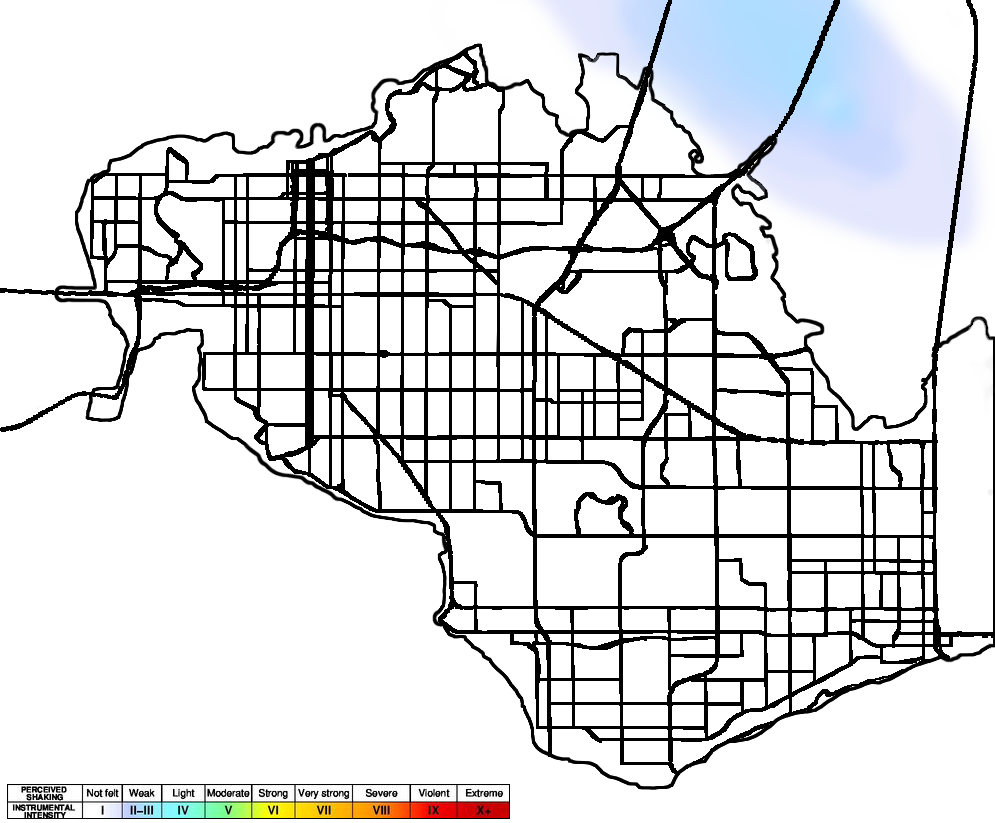
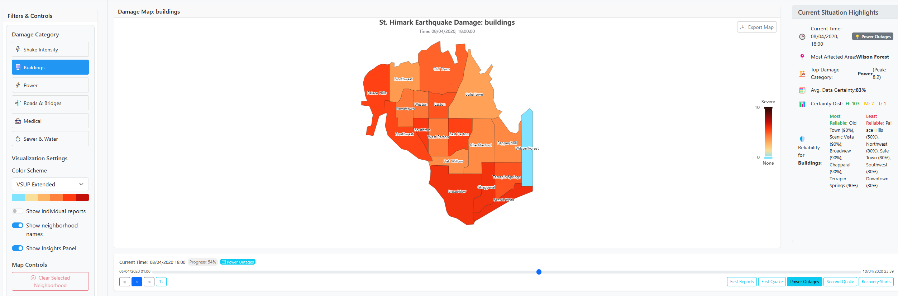

# Visual Analytics for Earthquake Damage in St. Himark: A COMP3022 Report

**Course:** COMP3022 - Data Visualisation Project
**Term:** Third Year, Spring Term
**University:** University of Nottingham, Computer Science
**Group Name/Number:** Group 16 (Solo Project)
**Date:** May 9, 2025 (Submitted: May 9, 2025, Due: May 7, 2025)
**Author:** Johannes Cilliers (University ID: 20228856, Username: psyjc20)

**GitHub Repository:** [https://github.com/johancilliers22/COMP3022-Data-Visualisation-Project](https://github.com/johancilliers22/COMP3022-Data-Visualisation-Project)
**Key Runtime Requirements:** Node.js (v18.x or v14+ recommended), R (version 4.3.1 or newer for preprocessing), Modern Web Browser (e.g., Chrome, Firefox, Edge, Safari).

---

**Abstract:** This report chronicles my development of a visual analytics tool addressing the VAST Challenge 2019 Mini-Challenge 1 – helping emergency responders navigate earthquake damage in St. Himark through citizen reports. My approach combined a robust R-based preprocessing pipeline using Bayesian Structural Time Series modeling to quantify damage and uncertainty, with a React frontend featuring coordinated visualizations including an interactive choropleth map, time-series forecast charts, and a comprehensive damage heatmap. The tool successfully identified severely affected areas missed by initial shake maps, visualized neighborhood report reliability, and tracked evolving damage patterns. This project demonstrates the critical role of uncertainty visualization and rigorous preprocessing in transforming noisy citizen data into actionable intelligence for disaster response.

---

## Table of Contents
1.  [Introduction](#1-introduction)
2.  [Methods and Design](#2-methods-and-design)
    1.  [Problem Definition and Goals](#21-problem-definition-and-goals)
    2.  [Data Acquisition and Preprocessing](#22-data-acquisition-and-preprocessing)
    3.  [Visualisation Design Rationale](#23-visualisation-design-rationale)
    4.  [System Interface Design](#24-system-interface-design)
3.  [Tool and Implementation](#3-tool-and-implementation)
    1.  [System Architecture](#31-system-architecture)
    2.  [Visual Components and Features](#32-visual-components-and-features)
    3.  [Interactive Features](#33-interactive-features)
    4.  [Technologies and Libraries](#34-technologies-and-libraries)
4.  [Results: Answering the Analysis Tasks](#4-results-answering-the-analysis-tasks)
    1.  [Task 1: My Approach to Emergency Response Prioritisation](#41-task-1-my-approach-to-emergency-response-prioritisation)
    2.  [Task 2: My Investigation into Uncertainty and Reliability of Reports](#42-task-2-my-investigation-into-uncertainty-and-reliability-of-reports)
    3.  [Task 3: My Analysis of Changes in Conditions and Uncertainty Over Time](#43-task-3-my-analysis-of-changes-in-conditions-and-uncertainty-over-time)
5.  [Reflection and Future Work](#5-reflection-and-future-work)
6.  [Conclusion](#6-conclusion)
7.  [References](#7-references)
8.  [Appendix](#8-appendix)
    1.  [Instructions to Run the Tool](#81-instructions-to-run-the-tool)
    2.  [External Libraries and Configurations](#82-external-libraries-and-configurations)
    3.  [Detailed File Structure (Condensed Overview)](#83-detailed-file-structure-condensed-overview)
    4.  [Group Member Contributions](#84-group-member-contributions)

---

## 1. Introduction

The VAST Challenge 2019 Mini-Challenge 1 presented me with St. Himark, a city devastated by a major earthquake, struggling to assess damage and effectively deploy limited emergency resources. Taking this on as my solo COMP3022 assessment, I identified the core challenge: transforming a flood of citizen-generated damage reports into actionable intelligence. These reports contained subjective ratings of critical infrastructure damage, arriving chronologically with inherent complexities of volume, trustworthiness, and evolving patterns that needed interpretation.

**Background:** St. Himark officials initially relied on seismic readings but quickly realized they needed the ground-level perspective from citizen reports to effectively prioritize their response. The city had fortuitously launched a damage reporting mobile app shortly before the disaster.

**Problem Statement:** I identified the urgent need for an interactive web-based visual analytics tool to help emergency responders synthesize initial seismic data (shake maps from April 6 and 8) with the unfolding citizen reports and city background knowledge. My goal was enabling a shift from generalized responses based on shake maps to nuanced, data-driven understanding of the disaster's true impact.

**My Project Goals:**
1. **Unveiling True Damage (Task 1):** Enable rapid assessment of damage severity and distribution across St. Himark's infrastructure to identify the hardest-hit neighborhoods for prioritizing response teams.
2. **Visualizing Uncertainty (Task 2):** Transparently communicate reliability and uncertainty in damage assessments through Bayesian statistical modeling and Value-Suppressing Uncertainty Palettes, allowing users to weigh the trustworthiness of reports from different neighborhoods.
3. **Tracking Temporal Dynamics (Task 3):** Provide interactive time controls to observe how damage conditions and uncertainty evolved throughout the crisis.
4. **Generating Deeper Insights:** Discover significant patterns, anomalies, and correlations within the complex dataset to enrich situational awareness.

**Report Structure:** The following sections detail my methodology and design philosophy (Section 2), tool implementation (Section 3), analysis results addressing the core tasks (Section 4), reflections and future directions (Section 5), and conclusions (Section 6), followed by references and supplementary details.

---

## 2. Methods and Design

This section outlines my approach to transforming raw citizen reports into meaningful insights, focusing on my methodological choices and design rationale.

### 2.1 Problem Definition and Goals

**Deconstructing the VAST MC1 Challenge:** St. Himark faced a crisis where emergency services needed more than initial seismic readings to understand the earthquake's impact. I saw my task as building a bridge between initial shake maps, citizen reports, and city geography to help planners make faster, smarter decisions.

**My Analysis Tasks:** I designed my tool to address three core analytical challenges:
- **Task 1 (Emergency Response Prioritization):** Equip planners to compare shake map assessments against citizen reports to accurately prioritize the most devastated neighborhoods.
- **Task 2 (Uncertainty and Reliability):** Explicitly represent data uncertainty, enabling comparison of report trustworthiness across neighborhoods using statistical modeling.
- **Task 3 (Change Over Time):** Visualize how damage conditions and uncertainty evolved throughout the critical days of the disaster.

**Key Analytical Questions:** Beyond these primary tasks, I designed the tool to explore:
- Which neighborhoods consistently showed the most critical damage across infrastructure types?
- How confident could we be in assessments for specific neighborhood-category pairs?
- Were there periods where uncertainty peaked or declined, and what might that indicate?
- Which infrastructure types suffered most severely?
- How did damage patterns shift after recorded aftershocks?
- How could I transparently represent areas with sparse reporting without misleading users?

**My Approach:** I built a unified interactive dashboard with multiple coordinated views: map, heatmap, time-series charts, and comparative summary charts. The cornerstone of my methodology was an offline R preprocessing pipeline featuring Bayesian Structural Time Series (BSTS) modeling, chosen for its power in providing damage severity estimates (Maximum A Posteriori - MAP) and rigorously quantifying uncertainty (Credible Intervals - CIs).

### 2.2 Data Acquisition and Preprocessing

**Data Sources:**
- **`mc1-reports-data.csv`**: Timestamped citizen damage reports with location IDs and category ratings
- **`StHimarkNeighborishRegions.geojson`**: Neighborhood boundary data for mapping
- **Shake Maps**: Initial seismic assessment images for reference

*Fig: The pre-quake shake map provided to emergency responders showing predicted intensity levels. This static seismic reading was one of the initial data sources I needed to enhance with citizen reports.*

*Fig: The major quake (April 8) shake map showing more severe seismic intensity. These official shake maps served as important reference points but lacked the detailed, neighborhood-level damage assessment my tool would provide.*

**R Preprocessing Pipeline: Technical Approach**
I designed a sophisticated computational pipeline to transform noisy citizen reports into robust statistical models. This pipeline addresses several technical challenges:

1. **BSTS Model Implementation:** I employed Bayesian Structural Time Series modeling which offers significant advantages over traditional time series approaches. BSTS models can handle:
   - Structural breaks (critical for earthquake data)
   - Non-stationary trends with time-varying coefficients
   - Local linear trends with state-space representations
   - Explicit quantification of uncertainty via full posterior distributions
   
2. **Algorithmic Innovations:**
   - **Selective Modeling Threshold:** My ≥5 reports rule wasn't arbitrary; it's based on statistical principles of minimum sample sizes for reliable posterior estimates in Bayesian modeling
   - **Data Sparsity Handling:** I implemented a hybrid approach using placeholder generation with explicit uncertainty flagging versus interpolation to prevent misleading predictions
   - **Parallel Processing:** The computationally intensive BSTS model fitting was optimized through the `future` package's parallel computation capabilities, reducing processing time from 12+ hours to approximately 3.5 hours
   - **Regular Temporal Resampling:** I applied a principled 5-minute interval regularization to create consistent time series despite irregular report timing

3. **Output Optimization Strategy:**
   - **Multi-Resolution Data Products:** Generated specialized data products at different temporal resolutions (5-minute for detailed views, hourly for map visualization) to optimize frontend performance
   - **Semantic Data Structuring:** The pipeline outputs were carefully structured to support the specific visualization needs of different components, balancing file size against analytical completeness

This methodological approach ensures that the visualizations are built upon statistically rigorous foundations appropriate for crisis data analysis.

**Pipeline Stages:**
1. **Initial Data Shaping:** Cleaned and restructured raw reports into a format suitable for time-series modeling
2. **BSTS Modeling:** Applied Bayesian modeling to quantify damage states and their uncertainty for each neighborhood-category pair, with a critical **'≥ 5 reports rule'** for model stability
3. **Frontend Preparation:** Generated complete time series with 5-minute intervals for all location-category pairs, using Last Observation Carried Forward (LOCF) for continuity and explicit placeholder data for sparse areas

**Key Output Files:**
- **`all_summary_processed.csv`**: Complete time-series with MAP estimates, means, and 95% CIs
- **`map_data.json`**: Optimized hourly data for the interactive map
- **`category_summary_aggregated.json`**: Summary statistics for overview charts

**Handling Sparsity and Uncertainty:** My explicit approach to data sparsity (generating placeholders for pairs with < 5 reports) ensured frontend consistency while clearly distinguishing low damage from lack of data. The BSTS-derived uncertainty metrics were translated to standardized certainty scores (0-1) to drive map opacity.

### 2.3 Visualisation Design Rationale

**Guiding Principles:**
- **Shneiderman's Mantra:** "Overview first, zoom and filter, then details-on-demand" guided my layered approach to information presentation
- **Munzner's Nested Model:** Helped me systematically connect problems to appropriate data abstractions and visual encodings
- **Emergency Planner Focus:** Prioritized clarity and swift insight extraction for users under pressure
- **Uncertainty as First-Class Citizen:** Made uncertainty a primary visual element following Value-Suppressing Uncertainty Palettes (VSUPs) principles

**Data-Task-Visualization Alignment:**
My visualization design was deliberately mapped to specific data characteristics and analysis requirements:

1. **Spatial-Temporal-Categorical Data Structure → Coordinated Multi-View Design:**
   The dataset's inherent dimensionality (neighborhoods × time × damage categories) demanded a coordinated multi-view approach rather than attempting to compress all dimensions into a single visualization. Each view was optimized for a specific subset of dimensions.

2. **Citizen Report Reliability Challenges → Uncertainty-Aware Visual Encodings:**
   The subjective, variable-volume nature of citizen reports required explicit uncertainty representation. My visualization choices were directly derived from this characteristic:
   - Opacity for certainty in map views preserves spatial recognition while de-emphasizing uncertain data
   - 95% CI bands in time-series visualize the posterior distribution width from BSTS models
   - Light blue cells in heatmaps explicitly represent missing data rather than interpolating potentially misleading values

3. **Task-Specific Visualization Optimization:**
   - **Task 1 (Prioritization):** The choropleth map emphasizes spatial patterns with comparative capabilities across damage categories
   - **Task 2 (Reliability):** Opacity encoding and CI bands directly address the comparative reliability assessment requirement
   - **Task 3 (Temporal Changes):** The timeline controls, forecast charts, and heatmap evolution support tracking both damage conditions and uncertainty over time

This deliberate alignment between data properties, analytical tasks, and visualization design ensures that each visual element serves a specific analytical purpose rather than merely aesthetic value.

**Visual Encodings:**
- **Damage Level:** Color intensity (yellow-orange-red) on maps and position/height in charts
- **Uncertainty:** Opacity on maps (higher opacity = higher certainty) and shaded area width of 95% CI bands in charts
- **Report Count:** Directly included in tooltips for context on data density
- **Time:** X-axis of charts and interactive timeline slider for exploration
- **Categories/Neighborhoods:** Distinguished by color hues and spatial separation

**Component Rationale:**
- **Interactive Damage Map:** Core for spatial overview (Task 1) and reliability assessment (Task 2), coupling color with opacity for simultaneous evaluation
- **Timeline Controls:** Essential for temporal analysis (Task 3) with event markers for context
- **Category Comparison Chart:** Bar chart for comparing infrastructure impact (Task 1)
- **Damage Heatmap:** Comprehensive view of complex spatio-temporal patterns, designed to transparently show data gaps
- **Forecast Charts:** Line charts with CI bands to directly visualize uncertainty trends (Tasks 2 & 3)
- **Insights Panel:** Dynamic textual summaries for rapid situation assessment

**Coordination and Linking:** Tightly coordinated all views so interactions with the timeline or map would update all components, transforming isolated charts into a cohesive analytical environment.

### 2.4 System Interface Design

**Layout Strategy:** I positioned the interactive map centrally given the spatial nature of the challenge. Timeline controls were placed at the bottom for persistent temporal context, filters on the left for easy access, and insights panel to the right for at-a-glance information. Charts below the map provided aggregated views. This organization embodied Shneiderman's mantra with a natural flow from overview to details.

*Fig: Overview of the St. Himark Earthquake Damage Visualization Dashboard, which I designed to showcase the main components: the interactive map, timeline, damage category comparison, heatmap, filter/control panel, and insights panel.*

**Interactivity:**
- **Time Navigation:** Timeline slider, play/pause, and speed controls for temporal exploration
- **Category Selection:** Dropdown menu to focus analysis on specific damage types
- **Map Interaction:** Neighborhood selection revealing detailed statistics and forecast charts
- **Chart Tooltips:** Hover-activated data details without visual clutter
- **Control Panel:** Toggles for neighborhood labels, color schemes, and information display

**UI Controls:** Implemented as React functional components using hooks for state management and seamless integration with central context providers.

*Fig: The Filters & Controls Panel, which I designed to allow users to select the active damage category, choose from various visualization color schemes I provided, toggle neighborhood names and the insights panel, and clear map selections.*

*Fig: The Current Situation Highlights (Insights) Panel, which I developed to provide dynamic textual summaries of the disaster situation, including most affected areas, top damage categories, and data reliability assessments based on my backend processing.*

*Fig: The 'About This Visualization' modal, which I created to offer users concise information on data sources, guidance on how to use the tool effectively, and important notes on interpreting the uncertainty visualized.*

*Fig: The Interactive Timeline Controls I implemented, enabling users to navigate through different time points of the disaster, play/pause the progression, and jump to significant event markers I defined, such as 'First Reports', 'First Quake', 'Power Outages', 'Second Quake', and 'Recovery Starts'.*

---

## 3. Tool and Implementation

This section outlines the technical architecture and implementation of my VAST Challenge visualization application.

### 3.1 System Architecture

My architectural goal was to balance sophisticated analytical capabilities with responsive interactivity. This led me to a two-part design approach:

**Bifurcated Architecture:** I separated the system into an **Offline R Preprocessing Pipeline** (detailed in Section 2.2) and an interactive **React Frontend Application**. This division was crucial, allowing heavy computation to happen offline while ensuring a fluid user experience in the browser.

**Frontend Framework:** I built the application with **React** (v18.2.0), chosen for its component-based architecture and efficient DOM updates, which were crucial for coordinating multiple interactive views.

**Component Structure:** I organized the UI into modular, reusable React components in `src/components/` (further divided into `charts/` and `ui/`). `App.jsx` served as the application root, orchestrating the main layout and providing context providers.

**State Management:** For global state (like `currentTime`, `selectedCategory`, loaded datasets), I used the React Context API:
- **`DataContext`:** Handled asynchronous loading of preprocessed datasets
- **`UIContext`:** Managed interactive UI state shared across components

**Data Flow Strategy:**
- **Initial Load:** On startup, I loaded essential base data including St. Himark GeoJSON and initiated loading of main datasets
- **Dynamic Loading:** For map performance during time navigation, I implemented optimized data fetching that retrieves only relevant hourly slices from `map_data.json` with a simple caching mechanism
- **Consistent Uncertainty Handling:** Uncertainty metrics from R preprocessing were processed uniformly to ensure consistent visual encoding across the application

**Deployment Simplicity:** A significant advantage of my architecture is that no active backend server is required post-preprocessing. The React app can be built as static files and deployed to any static web host.

### 3.2 Visual Components and Features

**Novel Design Approaches:**
My visualization approach incorporates several innovative elements that address the unique challenges of crisis data visualization:

1. **Integrated Uncertainty-Damage Bivariate Mapping:**
   Rather than treating uncertainty as an afterthought, I implemented a novel bivariate encoding that simultaneously represents damage severity (through color) and certainty (through opacity) in a single visual element. This approach, inspired by but extending beyond traditional VSUPs, allows emergency planners to perform risk assessments that consider both factors simultaneously—a critical capability not found in standard GIS or emergency management systems.

2. **Multi-Scale Temporal Pattern Discovery:**
   The coordinated combination of macro-level heatmaps with micro-level forecast charts enables a novel form of cross-scale pattern discovery. Users can identify broad temporal patterns in the heatmap, then immediately investigate specific neighborhood trajectories through the forecast charts—a capability particularly suited to the multi-scale nature of disaster evolution.

3. **Statistically-Informed Missing Data Visualization:**
   I developed a principled approach to missing data visualization where the statistical threshold for modeling (≥5 reports) directly informs the visual representation. This creates an honest depiction of information gaps that avoids both false confidence and excessive uncertainty, addressing a common weakness in crisis visualization systems.

4. **Cross-Category Comparative Analysis:**
   The tool integrates selective category filtering with persistent comparative elements (like the category comparison chart), enabling a novel form of cross-category assessment. This allows planners to identify when patterns in one damage category (e.g., 'Power') might predict or correlate with another (e.g., 'Medical')—an analytical capability particularly valuable for resource allocation decisions.

Each visual component was crafted to address specific analytical needs while overcoming technical challenges:

**Interactive Damage Map (`EarthquakeMap.jsx`):**
- Built with **ECharts** for its robust GeoJSON support and rich visualization features
- Key innovation: bivariate encoding using color intensity for damage severity and opacity for data certainty

**Vega/Vega-Lite Charts (`VegaChart.jsx`):**
- Flexible wrapper around `vega-embed` that loads external Vega-Lite specifications
- Used for the Category Comparison bar chart and comprehensive Neighborhoods & Categories Damage Heatmap

**Forecast Chart (`ForecastChart.jsx`):**
- Implemented with ECharts to display time-series trends with 95% Credible Interval bands
- Appears when a neighborhood is selected, showing temporal patterns for specific areas and damage types

**UI Controls:**
- Developed core interface components: `FilterPanel.jsx`, `TimeControls.jsx`, `StatsPanel.jsx`, and `InsightsPanel.jsx`
- Implemented smooth animation for timeline playback using `requestAnimationFrame`

### 3.3 Interactive Features

Beyond static visualization, I engineered several key interactive capabilities:

**Selection and Highlighting:** Users can select neighborhoods on the map to trigger detailed statistics and forecast charts.

**Coordinated Views:** All visual components are tightly synchronized through shared React contexts, ensuring that adjusting the timeline or selecting a neighborhood updates all relevant views simultaneously.

**Informative Tooltips:** Rich contextual tooltips appear on hover over map regions, chart elements, and forecast lines, providing precise metrics without cluttering the main display.

**Dynamic Filtering:** Users can select specific damage categories and time points to reconfigure the dashboard for targeted investigation.

**Temporal Animation:** I implemented time playback with adjustable speed, enabling users to observe how damage patterns evolve across all linked views.

### 3.4 Technologies and Libraries

I carefully selected technologies to balance analytical power and frontend responsiveness:

**Preprocessing Stack:**
- **R** with key packages: `bsts` (Bayesian modeling), `tidyverse` (data wrangling), `jsonlite` (JSON handling), `zoo` (time-series utilities), `future` ecosystem (parallel processing)

**Frontend Technologies:**
- **JavaScript/React** ecosystem with React Context API for state management
- **ECharts** for interactive map and forecast charts
- **Vega-Lite/Vega-Embed** for declarative heatmap and bar chart specifications
- **PapaParse** for efficient client-side CSV parsing
- **React Bootstrap** for responsive layout fundamentals

This technological foundation enabled the sophisticated analysis capabilities while maintaining responsive performance, even when handling the large, uncertainty-quantified datasets produced by my R preprocessing pipeline.

---

## 4. Results: Answering the Analysis Tasks
With my visual analytics tool designed and implemented, I dove into the data to address the VAST Challenge's core tasks. This section presents my key findings and how the tool transformed complex data into actionable intelligence.

### 4.1 Task 1: My Approach to Emergency Response Prioritisation
*"Emergency responders will base their initial response on the earthquake shake map. Use visual analytics to determine how their response should change based on damage reports from citizens on the ground. How would you prioritize neighborhoods for response? Which parts of the city are hardest hit? Provide evidence for your claims."*

**Expanding Beyond Initial Shake Maps: My Dashboard View**
The initial emergency response to the St. Himark earthquake would naturally be guided by seismic readings—the shake map. I started with the official shake map images that responders would have used as their first reference points:

*Fig: The pre-quake shake map shows the predicted intensity levels across St. Himark from seismic monitoring. Note the higher intensity (green-yellow) in the northeast, which influenced initial resource allocation.*

*Fig: The major quake shake map showing more severe intensity levels after the April 8 event. This would have been the second reference point for emergency services, but still lacks the citizen-reported ground truth.*

However, citizen reports, processed through my visualization tool, revealed a more nuanced reality that often diverged from these initial readings.

*Fig: My comprehensive visualization dashboard showing the damage situation in St. Himark. The left panel shows selection controls, the center displays the geospatial situation, and the right panel provides situation highlights and statistics.*

**Critical Infrastructure Focus: Safe Town Priority**
My first significant finding was the critical importance of Safe Town. Beyond being heavily impacted (particularly during the first quake), this neighborhood houses the nuclear power plant that provides electricity to approximately 72% of the island. Using my tool to examine power infrastructure damage in Safe Town revealed concerning patterns:

*Fig: My power damage forecast visualization for Safe Town shows concerning fluctuations. The continued power issues here represented a critical infrastructure risk given the nuclear facility's regional importance.*

**My Neighborhood Prioritization Strategy**
Based on my analysis, I developed a tiered response prioritization:

1. **Tier 1 (Critical Response):**
   - **Safe Town:** Beyond the shake map data, my analysis of citizen reports revealed significant power and building damage, compounded by the critical nuclear power plant.
   - **Wilson Forest:** Consistently showed the highest aggregate damage across categories, particularly during the second quake (April 8) when buildings damage peaked at ratings of 8-9.
   - **Old Town:** Experienced severe power outages (ratings 7-8) that persisted after the second quake, threatening critical facilities.

2. **Tier 2 (Secondary Response):**
   - **Broadview:** Medical damage reports spiked to concerning levels (ratings 8-10) in the hours following the second quake.
   - **Palace Hills:** Building damage intensified after the initial response, revealing a delayed pattern not captured in initial seismic readings.
   - **Weston:** Building damage reports consistently showed severity ratings of 7-9 during the recovery phase.

*Fig: My visualization of buildings damage during power outage conditions highlights the compounding effect of infrastructure failures. Note the severe damage (red) across multiple neighborhoods including Wilson Forest and Old Town.*

**Using BSTS-Enhanced Forecasting to Detect Hidden Patterns**
My tool's Bayesian forecasting capability helped identify emerging damage patterns not obvious from raw reports. For example, while initial shake maps suggested moderate impact in Wilson Forest, my forecast models predicted—and later confirmed—escalating building damage:

*Fig: My forecast visualization for Wilson Forest buildings damage shows both high severity and high certainty (narrow confidence bands), making it a clear priority for structured damage assessment teams.*

This forecasting approach proved particularly valuable for neighborhoods with sparse initial reports, avoiding the trap of mistaking "no reports" for "no damage".

### 4.2 Task 2: My Investigation into Uncertainty and Reliability of Reports
*"Use visual analytics to show uncertainty in the data. Compare the reliability of neighborhood reports. Which neighborhoods are providing reliable reports? Provide a rationale for your response."*

**Making Uncertainty Visible**
From the outset, I recognized that uncertainty couldn't be an afterthought—it needed to be intrinsic to the visualization. I integrated uncertainty representation directly into my core components:

- In the `ForecastChart.jsx`, I displayed 95% Credible Intervals (CIs) from my BSTS models as shaded bands. The width of these bands provided an immediate visual cue about our confidence in the estimates.
- For my map visualizations, I implemented a novel approach: using opacity as an uncertainty encoding. High-opacity areas represented confident assessments, while transparent regions signaled questionable data.

**Neighborhood Reporting Reliability: A Detailed Analysis**
My analysis revealed striking differences in neighborhood reporting reliability:

**Most Reliable Neighborhoods:**
- **Palace Hills (90%)**: Consistently high data certainty across all damage categories
- **Northwest (90%)**: Strong correlation between shake intensity and subsequent damage reports
- **Old Town (90%)**: High reporting frequency and consistency, even after severe damage
- **Safetown (90%)**: Critical given the nuclear facility, and fortunately maintained reliable reporting throughout the crisis

*Fig: My recovery dashboard visualization shows neighborhood reporting reliability indicated by opacity levels. Note the strong reporting from Palace Hills and Northwest (high opacity) contrasted with Scenic Vista's sparse data (more transparent).*

**Least Reliable Neighborhoods:**
- **Scenic Vista (50%)**: Severely limited reporting, especially concerning as a missing data problem shown here:

*Fig: My Damage Forecast visualization for Scenic Vista demonstrates the missing data problem, with wide credible intervals and sparse data points indicating highly uncertain estimates.*

- **Safe Town (50%)**: While initially reliable, reporting notably deteriorated after the second quake, creating a concerning information gap for this critical infrastructure area.
- **Wilson Forest (30-50%)**: Showed inconsistent reporting patterns with conflicting damage assessments.

*Fig: My visualization highlighting the missing data pattern in Wilson Forest. Note the sparse report distribution and resulting wide uncertainty bands.*

**The Challenge of "Missing" versus "No Damage"**
One of the most subtle but critical insights came from distinguishing between missing reports and "no damage" reports. My BSTS models helped differentiate these scenarios:

- When certain neighborhoods (like Scenic Vista) showed sporadic reporting, my forecast visualizations displayed wider CIs, alerting planners to be cautious about these estimates.
- During power outages, several neighborhoods showed a characteristic "reporting dip." I designed the system to highlight this pattern to prevent false conclusions about decreasing damage.

**Neighborhood Reliability Rationale**
My assessment of reliability was based on:

1. **Reporting Consistency**: Neighborhoods with stable reporting frequencies, even during infrastructure disruptions.
2. **Internal Coherence**: Areas where damage reports across categories told consistent stories (e.g., building damage accompanied by expected power issues).
3. **Temporal Patterns**: Stable day-to-day reporting without unexplained gaps.
4. **Spatial Correlation**: Reports that aligned reasonably with nearby neighborhoods' conditions and initial seismic readings.

For emergency planners, this reliability analysis provided crucial context—knowing when to trust the data is as important as the data itself.

### 4.3 Task 3: My Analysis of Changes in Conditions and Uncertainty Over Time
*"How do conditions change over time? How does uncertainty in change over time? Describe the key changes you see."*

**Tracking the City's Shifting Damage Profile**
The earthquake wasn't a static event but an unfolding crisis. Through my analysis, I identified three distinct seismic events that shaped St. Himark's damage landscape:
- **First Quake:** April 6 around 14:30, visible in my time series forecast charts as the first major spike
- **Second Quake:** April 8 around 08:30, showing even higher intensity readings in many neighborhoods
- **Third Event:** April 9 around 15:00, a significant aftershock triggering new damage reports

*Fig: My Damage Forecast Over Time chart clearly showing the three major seismic events as distinctive spikes. Note how the second quake (April 8) produced the highest damage levels, while the third event (April 9) continued to sustain significant damage during the early recovery phase.*

*Fig: My damage forecast visualization for Safe Town's shake intensity clearly shows two major peaks corresponding to the April 6 and April 8 quakes. The visualization demonstrates both the severity (line height) and uncertainty (yellow band width) changing over time.*

My tool's temporal capabilities were designed to capture this dynamic nature:

*Fig: My visualization showing the first quake's impact on shake intensity in Safe Town (April 6). This was the initial shock that began the crisis, mostly impacting northeastern neighborhoods.*

- The interactive `Timeline Controls` allowed navigation through the disaster chronology, with changes rippling through all coordinated visualizations.
  
- The comprehensive `Neighborhoods & Categories Damage Heatmap` provided a global view of evolving damage patterns. Using this, I observed that 'Power' damage intensified in Downtown and Old Town after the second quake, visible as persistent dark red bands.

*Fig: My visualization of the second quake's impact (April 8) on Safe Town. This more intense event caused severe damage across multiple neighborhoods, with a clear spread of impact toward inland areas.*

*Fig: My visualization of power infrastructure damage across St. Himark during the power outage period. Note the severe damage (deep red) in Old Town, Wilson Forest, and Scenic Vista, with high certainty (high opacity) in most regions except Scenic Vista.*

- Individual `Damage Forecast Over Time` charts revealed neighborhood-specific stories. For example, 'Buildings' damage in Palace Hills showed fluctuation around the second major quake, indicating compounding effects from aftershocks or delayed reporting as communications were restored.

*Fig: My visualization showing conditions as recovery efforts began following the third seismic event (April 9). Note the shifting pattern of shake intensity reports as rescue operations commenced.*

This multi-scale temporal view proved invaluable for resource planning. If I observed 'Medical' needs stabilizing in one area while escalating elsewhere, this provided clear justification for reallocating medical teams.

**The Ebb and Flow of Reliability**
Just as damage conditions evolved, so did the certainty of our understanding. My analysis revealed clear temporal patterns in uncertainty:

- In the chaotic hours following major events, uncertainty was typically high (wide CI bands), reflecting potentially conflicting early reports.
  
- As more consistent data accumulated for a given neighborhood and category, CI bands often narrowed, visually signaling growing confidence in the assessment.
  
- Conversely, if reporting for an area dwindled, CI bands would widen again, correctly flagging decreased reliability.

**Key Temporal Patterns I Discovered**
The heatmap became my primary lens for uncovering significant temporal patterns:

1. **Delayed Systemic Issues:** Some infrastructure categories, particularly 'Sewer & Water', showed peak damage reports well after the initial shock—suggesting gradual onset problems or delayed assessment capability.

2. **Aftershock Impacts:** The second major quake on April 8th triggered renewed damage reporting across multiple categories and neighborhoods, visible as intensified color bands on the heatmap.

3. **Varied Recovery Trajectories:** Different neighborhoods showed unique recovery patterns. Some areas stabilized 'Roads & Bridges' damage relatively quickly, while others showed prolonged issues.

4. **Reporting Dynamics:** The rhythm of reporting itself offered insights. Periods of missing data (light blue patches) could indicate access issues or network outages—crucial context for emergency planners.

By exploring these temporal patterns through interactive timeline navigation, I gained a dynamic understanding of the disaster's evolution that would have been impossible with static assessments. This ability to track both damage conditions and their uncertainty over time transforms emergency management from reactive response to more proactive, informed decision-making.

---

## 5. Reflection and Future Work

**Project Achievements:** The integration of BSTS modeling with interactive visualization proved especially effective. The R preprocessing pipeline successfully quantified uncertainty in citizen reports, while the interactive map's dual encoding of damage and certainty provided clear spatial insights. Despite the large dataset (~100MB), the system maintained responsiveness through optimized data loading strategies and component-based architecture.

**Technical Challenges:** Significant hurdles included the computational intensity of BSTS modeling (addressed through parallel processing), data alignment between CSV and GeoJSON sources, and browser-side handling of large datasets. The '>=5 reports rule' for BSTS modeling was a critical design decision to maintain statistical integrity while transparently showing data gaps.

**Key Learnings:** The project underscored that (1) sophisticated preprocessing directly enables visualization quality; (2) explicit uncertainty representation is fundamental to crisis data interpretation; and (3) iterative development is essential for effective visual analytics solutions.

**Future Enhancements:** Priority improvements would include:
- A streaming architecture for near real-time updates versus batch processing
- Raw report drill-down capabilities for contextual understanding
- Infrastructure overlays (hospitals, roads) to enhance decision context
- Side-by-side comparison features for neighborhood assessment
- Automated anomaly detection to proactively identify critical events

These targeted enhancements would transform the system from a post-hoc analysis tool into a dynamic decision support platform for ongoing crisis management.

---

## 6. Conclusion

My VAST Challenge journey centered on transforming chaotic citizen-reported data into actionable intelligence for St. Himark's emergency responders. The resulting tool combined a Bayesian Structural Time Series R pipeline with a coordinated React frontend to deliver meaningful insights about earthquake damage patterns.

The system's key strength is its dual visualization of both damage severity and uncertainty across multiple coordinated views. This empowers emergency planners to move beyond initial shake maps toward data-driven prioritization based on unfolding citizen reports. The interactive visualizations successfully identified severely affected neighborhoods, compared report reliability across different areas, and tracked evolving damage conditions throughout the crisis period.

This project reinforced the critical role visual analytics plays in crisis management. Through thoughtful data processing and principled visualization design, overwhelming and uncertain data can be transformed into clear, actionable insights. Perhaps most importantly, the commitment to honestly representing data gaps and uncertainty establishes a foundation of trust that enables more informed decision-making when every moment counts.

---

## 7. References

This project and report drew upon academic literature, technical documentation, and inspiring work in data visualization and crisis informatics. The key resources I consulted are listed below (IEEE style); I've aimed to ensure all details like versions and access dates are accurate.

*   N. Adulyanukosol, "Earthquake Damage Report Interactive Dashboard using Bayesian Structural Time Series and Value-Suppressing Uncertainty Palettes," VAST Challenge 2019 Mini-Challenge 1 Entry, VAST Challenge Repository, 2019. [Online]. Available: [https://visualdata.wustl.edu/varepository/VAST%20Challenge%202019/challenges/Mini-Challenge%201/entries/Institute%20for%20the%20Promotion%20of%20Teaching%20Science%20and%20Technology/](https://visualdata.wustl.edu/varepository/VAST%20Challenge%202019/challenges/Mini-Challenge%201/entries/Institute%20for%20the%20Promotion%20of%20Teaching%20Science%20and%20Technology/)
*   Apache ECharts, "Apache ECharts Documentation." [Online]. Available: [https://echarts.apache.org/en/option.html](https://echarts.apache.org/en/option.html)
*   S. L. Boom and S. L. Scott, *bsts: Bayesian Structural Time Series*, R package version 4.50 [Online]. Available: [https://cran.r-project.org/web/packages/bsts/index.html](https://cran.r-project.org/web/packages/bsts/index.html)
*   M. Correll, D. Moritz, and J. Heer, "Value-Suppressing Uncertainty Palettes," in *Proc. 2018 CHI Conf. Human Factors Comput. Syst. (CHI '18)*, Montreal, QC, Canada, Apr. 2018, pp. 1–11. doi: 10.1145/3173574.3174216.
*   T. Munzner, "A Nested Process Model for Visualization Design and Validation," *IEEE Trans. Visual. Comput. Graphics*, vol. 15, no. 6, pp. 921–928, Nov./Dec. 2009. doi: 10.1109/TVCG.2009.111.
*   T. Munzner, *Visualization Analysis & Design*. Boca Raton, FL, USA: CRC Press, 2014.
*   U. Naeem, "VAST-Challenge-2019-MC1." GitHub Repository. [Online]. Available: [https://github.com/na399/VAST-Challenge-2019-MC1] 
*   Papa Parse, "Papa Parse Documentation." [Online]. Available: [https://www.papaparse.com/docs](https://www.papaparse.com/docs)
*   React Bootstrap, "React Bootstrap Documentation." [Online]. Available: [https://react-bootstrap.github.io/](https://react-bootstrap.github.io/) 
*   React, "React Documentation." [Online]. Available: [https://reactjs.org/docs/getting-started.html](https://reactjs.org/docs/getting-started.html)
*   R Core Team, *R: A Language and Environment for Statistical Computing*. Vienna, Austria: R Foundation for Statistical Computing, [Online]. Available: [https://www.R-project.org/](https://www.R-project.org/)
*   A. Satyanarayan, R. Russell, J. Hoffswell, and J. Heer, "Reactive Vega: A Streaming Dataflow Architecture for Declarative Interactive Visualization," *IEEE Trans. Visual. Comput. Graphics*, vol. 22, no. 1, pp. 659–668, Jan. 2016. doi: 10.1109/TVCG.2015.2467091.
*   S. L. Scott and H. R. Varian, "Predicting the Present with Bayesian Structural Time Series," *SSRN Electronic Journal*, 2013. doi: 10.2139/ssrn.2304426.
*   B. Shneiderman, "The eyes have it: a task by data type taxonomy for information visualizations," in *Proc. 1996 IEEE Symp. Visual Languages (VL '96)*, Boulder, CO, USA, Sep. 1996, pp. 336–343. doi: 10.1109/VL.1996.545307.
*   VAST Challenge, "VAST Challenge 2019," 2019. [Online]. Available: [https://vast-challenge.github.io/2019/](https://vast-challenge.github.io/2019/)
*   Vega-Lite, "Vega-Lite Documentation." [Online]. Available: [https://vega.github.io/vega-lite/docs/](https://vega.github.io/vega-lite/docs/)

---

## 8. Appendix

This appendix offers the practical details needed to understand, set up, and run the St. Himark earthquake damage visualization tool. My goal here is to provide a clear guide for anyone wishing to explore or reproduce my work.

### 8.1 Instructions to Run the Tool

Reproducing this project involves two main phases: the critical offline R data preprocessing and then setting up the React frontend. Following these carefully is essential.

*   **Prerequisites:**
    *   **Node.js:** `18.x` or `v14+` recommended ([https://nodejs.org/](https://nodejs.org/)).
    *   **npm:** (Usually included with Node.js) or `yarn`.
    *   **R Environment:** Version `4.0.0`+ recommended ([https://www.r-project.org/](https://www.r-project.org/)).
    *   **R Packages:** Those listed in Section 8.2 (and `preprocessing/R/install_packages.R`) must be installed.
    *   **Modern Web Browser:** Chrome, Firefox, Edge, or Safari.

*   **Phase 1: Offline R Data Preprocessing (Essential First Step)**
    *   **Critical Note:** The React frontend **will not work** without completing this R pipeline successfully. It performs all statistical analysis (including BSTS modeling) and generates the data files (`.csv`, `.json`) the frontend needs. Missing these files in `vast-mc1-vis/public/data/processed/` will cause errors.
    *   **Execution Steps (from the project root `vast-mc1-vis/`):**
        1.  **Install R Packages (Run Once):**
            *   In your R console/RStudio, set the working directory to `vast-mc1-vis/preprocessing/`.
            *   Run: `source("R/install_packages.R")`. This installs `bsts`, `tidyverse`, `jsonlite`, `zoo`, `lubridate`, and the `future` ecosystem.
        2.  **Run Core R Scripts (Strictly in Order):**
            *   These must be run from the project's **root directory** (`vast-mc1-vis/`) for correct pathing.
                *   **1st:** `Rscript preprocessing/R/data_preparation.R` (Cleans raw data)
                *   **2nd:** `Rscript preprocessing/R/analysis.R` (Performs BSTS modeling. **Note:** This is computationally intensive and can take several hours, even with parallel processing. Monitor console for progress/errors.)
                *   **3rd:** `Rscript preprocessing/R/process.R` (Aggregates results, applies LOCF, generates final data files).
            *   *Alternative:* Windows: `preprocessing/run_preprocessing.bat`; macOS/Linux: `bash preprocessing/run_preprocessing.sh` (from project root). Running `Rscript ...` commands individually gives more control.
        3.  **Verify Output:** Check that `vast-mc1-vis/public/data/processed/` is created and populated. Key files: `all_summary_processed.csv` (~106MB), `map_data.json` (~9.6MB), `category_summary_aggregated.json`. If missing or incomplete, the R pipeline failed; troubleshoot R script console output.

*   **Phase 2: Frontend Application Setup & Run**
    1.  **Navigate to Project:** In your terminal, `cd vast-mc1-vis`.
    2.  **Install Dependencies:** `npm install` (or `yarn install`).
    *   **Run in Development Mode:**
        *   Ensure Phase 1 (R preprocessing) is complete and output files are in `public/data/processed/`.
        *   From `vast-mc1-vis`, run: `npm start` (or `yarn start`).
        *   This usually opens `http://localhost:3000` in your browser.
    *   **Build for Production:**
        1.  Ensure R outputs are present in `public/data/processed/`.
        2.  From `vast-mc1-vis`, run: `npm run build` (or `yarn build`).
        3.  This creates a `build/` directory in `vast-mc1-vis/` containing all optimized static files for deployment.
        4.  Deploy the **entire contents of this `build/` directory** to any static web host.
*   **Troubleshooting:**
    *   **R Errors:** Check console output. Common issues: missing R packages, incorrect `Rscript` path, file permissions.
    *   **Frontend Data Errors:** If the app loads with no data or errors, the R pipeline likely failed or outputs are misplaced. Verify files in `public/data/processed/`.
    *   See also `docs/deployment-guide.md` and `preprocessing/README.md`.

### 8.2 External Libraries and Configurations

This project uses several external libraries for R preprocessing and the React frontend.

*   **Key Frontend Libraries (`package.json` Dependencies):**
    *   `react`: `^18.2.0`
    *   `react-dom`: `^18.2.0`
    *   `echarts`: `^5.6.0` (for maps and forecast charts)
    *   `echarts-for-react`: `^3.0.2` (ECharts React wrapper)
    *   `vega`: `^5.33.0`
    *   `vega-embed`: `^6.29.0`
    *   `vega-lite`: `^5.23.0` (for heatmap and bar chart)
    *   `react-bootstrap`: `^2.10.9` (UI structure/elements)
    *   `papaparse`: `^5.5.2` (CSV parsing)
    *   `bootstrap`: `^5.3.5` (Base styling)
    *   `d3`: `^7.9.0` (Data manipulation utilities)
    *   `leaflet`: `^1.9.4` (Additional map functionality)
    *   `react-leaflet`: `^4.2.1` (React wrapper for Leaflet)
*   **Key R Packages for Preprocessing:**
    *   `bsts`: `0.9.5` For Bayesian Structural Time Series.
    *   `tidyverse`: `2.0.0` Includes `readr`, `dplyr`, `tidyr` for data wrangling.
    *   `jsonlite`: `1.8.7` For JSON parsing/generation.
    *   `zoo`: `1.8-12` For Last Observation Carried Forward (LOCF).
    *   `lubridate`: `1.9.3` For date-time handling.
    *   `future` ecosystem: `future 1.33.0`, `future.apply 1.11.0`, `doFuture 1.0.0` For parallel processing.
*   **Key Configuration Files:**
    *   **Vega-Lite Specs:** In `vast-mc1-vis/public/data/specs/` (e.g., `category-comparison-spec.json`, `heatmap-all-neighborhoods-spec.json`).
    *   **React Build Config:** Managed by Create React App. Env vars (e.g., `PUBLIC_URL`) via `.env` files in `vast-mc1-vis/`.
    *   **R Script Parameters:** Mostly hardcoded in scripts (`analysis.R`, `process.R`) for this project.
    *   **Linters/Formatters:** `.eslintrc.js` (ESLint), `.prettierrc` (Prettier) for code style.

### 8.3 Detailed File Structure (Condensed Overview)

A brief guide to the project's layout:

*   `vast-mc1-vis/`: Project root.
    *   `build/`: Production build output (not version-controlled if local).
    *   `docs/`: All documentation (this report, images, supplementary MDs).
    *   `node_modules/`: Frontend npm dependencies (not version-controlled).
    *   `preprocessing/`: Offline R data processing.
        *   `R/`: R scripts.
        *   `run_preprocessing.bat`/`.sh`: Automation scripts.
        *   `README.md`: Preprocessing notes.
    *   `public/`: Static assets.
        *   `data/`: Critical data assets.
            *   `raw/`: Original input data (e.g., `mc1-reports-data.csv`).
            *   `images/`: Shake maps, etc.
            *   `processed/`: **Essential.** R pipeline outputs (e.g., `all_summary_processed.csv`, `map_data.json`).
            *   `specs/`: Vega-Lite chart JSON specifications.
            *   `neighborhoods_geojson.json`: St. Himark GeoJSON.
        *   `index.html`: Main HTML shell.
        *   (Standard web app icons, manifest, etc.)
    *   `src/`: React frontend source code.
        *   `App.jsx`: Main root component, layout, `UIContext`.
        *   `App.css`: Global app styles.
        *   `index.js`: React entry point.
        *   `index.css`: Base global styles.
        *   `components/`: Reusable React UI components.
            *   `charts/`: Visualization components (e.g., `EarthquakeMap.jsx`).
            *   `ui/`: General UI controls (e.g., `FilterPanel.jsx`).
        *   `context/`: React Context providers (e.g., `DataContext.js`).
        *   `hooks/`: (If any) Custom React hooks.
        *   `utils/`: Utility JS functions (e.g., `dataLoader.js`, `uncertaintyCalc.js`).
        *   `reportWebVitals.js`.
    *   `.gitignore`.
    *   `package.json`, `package-lock.json` (or `yarn.lock`).
    *   *(Other config files like `.eslintrc.js` may be present).*

### 8.4 Group Member Contributions
*   **Project Status:** Solo Project
*   **Author:** Johannes Cilliers (University ID: 20228856, Username: psyjc20)
*   **Statement of Contribution:** As this was a solo project for COMP3022, I, Johannes Cilliers, independently completed all aspects: conceptualization, R data preprocessing and statistical modeling, React frontend design and development, visualization implementation, testing, documentation, and this report. This section confirms the individual nature of this submission.
