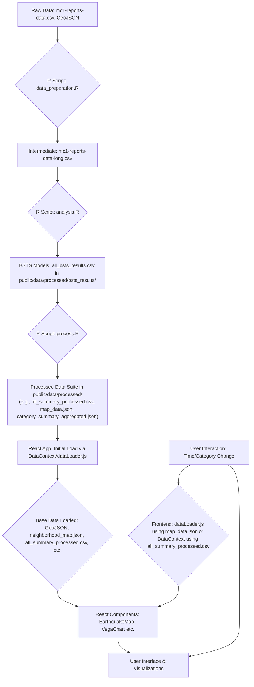

# Technical Architecture

## 1. Technology Stack

The VAST Challenge visualization application is built using modern web technologies, with a focus on interactive data visualization and a robust offline preprocessing pipeline.

### Backend: Offline Data Preprocessing (R Environment)
- **R**: Core language for statistical analysis and data manipulation.
- **Key R Packages**:
    - `tidyverse` (including `dplyr`, `readr`): For general data wrangling.
    - `bsts`: For Bayesian Structural Time Series modeling.
    - `jsonlite`: For reading and writing JSON files.
    - `lubridate`: For date/time manipulation.
    - `zoo`: For time series utilities like Last Observation Carried Forward (LOCF).
    - `future`, `future.apply`, `doFuture`: For parallel processing to expedite `analysis.R`.

### Frontend Framework
- **React**: A JavaScript library for building user interfaces.
- **React Context API & Custom Hooks**: For global and local state management (e.g., `DataContext` via `useData`, and `UIContext` via `useUI` in `App.jsx`).

### Visualization Libraries
- **ECharts**: Used for the main interactive map visualization (`EarthquakeMap.jsx`), leveraging its capabilities for geo-spatial rendering, data-driven styling (choropleth maps), tooltips, and uncertainty representation (e.g., via opacity).
- **Vega-Embed (for Vega/Vega-Lite)**: Used for other charts (`VegaChart.jsx`), such as the category comparison bar chart and the main data heatmap, by rendering provided Vega/Vega-Lite JSON specifications found in `public/data/specs/`.

### Styling and UI
- **React Bootstrap**: Provides UI components and a responsive grid system.
- **Custom CSS**: Component-specific (`*.css` files alongside components) and global stylesheets (`App.css`, `index.css`) for tailored appearance.

### Frontend Data Handling
- **`axios` (or `fetch` API)**: For loading static data files (GeoJSON, processed CSVs, and JSONs).
- **`papaparse`**: For client-side parsing of CSV files (e.g., `all_summary_processed.csv`).
- **Custom Utilities**: JavaScript functions in `src/utils/dataLoader.js` (like `loadAllData`, `loadAllBSTSData`) and `src/utils/dataProcessor.js` are used to fetch, cache, parse, and provide processed data to components.

## 2. Application Architecture

The application comprises two main parts: an **Offline R Preprocessing Pipeline** and a **React Frontend Application**.

### Data Flow Diagram

**Data Flow Explanation:**

1.  **Offline R Preprocessing Pipeline** (executed manually or via batch scripts):
    *   **Raw Data Ingest (`data_preparation.R`)**: `mc1-reports-data.csv` is read, cleaned, and transformed (e.g., into a long format).
    *   **BSTS Modeling (`analysis.R`)**: Performs Bayesian Structural Time Series analysis on the report data. This is computationally intensive and benefits from parallel processing. It generates `all_bsts_results.csv`, containing modeled damage values and uncertainty metrics, but only for location-category pairs with sufficient input data (>= 5 reports).
    *   **Final Processing & Formatting (`process.R`)**: Consumes `all_bsts_results.csv`. It creates a complete 5-minute interval time series for all location-category pairs, using LOCF for modeled data and generating placeholders (0 damage, default uncertainty) for unmodeled pairs. It outputs a suite of structured CSV and JSON files (e.g., `all_summary_processed.csv`, `map_data.json`, `category_summary_aggregated.json`) into `public/data/processed/`, optimized for frontend consumption.
2.  **React Frontend Application**:
    *   **Initial Data Loading (`DataContext.js`, `utils/dataLoader.js`)**: On application start, essential pre-processed files like GeoJSON, `neighborhood_map.json`, and potentially large datasets like `all_summary_processed.csv` (parsed using `papaparse`) are loaded and made available through `DataContext`.
    *   **Dynamic Data Slicing/Fetching**: 
        *   For the `EarthquakeMap.jsx`, `utils/dataLoader.js` (specifically `loadAllBSTSData`) fetches relevant hourly slices from `map_data.json` based on the selected time and category.
        *   For the `VegaChart.jsx` (heatmap), data is often derived from the globally loaded `all_summary_processed.csv` and filtered/aggregated as needed within the frontend (e.g., by `useFilteredData.js` or component logic).
        *   The `category-comparison-spec.json` for `VegaChart.jsx` directly uses `category_summary_aggregated.json`.
    *   **Data Transformation & Binding**: Components prepare this data for ECharts or Vega-Lite specifications.
    *   **Rendering & Interaction**: Visualizations are rendered. User interactions update state in `UIContext` or `DataContext`, potentially triggering re-filtering or re-fetching of data slices and subsequent re-renders.

### State Management

The application primarily uses React's Context API:

- **`DataContext` (`src/context/DataContext.js`)**: Manages the primary pre-processed datasets (GeoJSON, parsed `all_summary_processed.csv`, `category_summary_aggregated.json`, etc.), loading status, and error states. Data and utility functions are exposed via the `useData` hook.
- **`UIContext` (`App.jsx`)**: Manages UI-specific state such as `currentTime`, `selectedNeighborhood`, `selectedCategory`, `colorScheme`, `activeColorSchemePalette`, `showNeighborhoodLabels`, `sidebarCollapsed`, `showInsightsPanel`, and `isLoadingBsts` (for `EarthquakeMap` specific loading). Exposed via the `useUI` hook.

### Component Structure

(Refer to `component-structure.md` for a detailed breakdown)
Components are organized by function in `src/components/`:
- **Chart Components (`charts/`)**: `EarthquakeMap.jsx`, `VegaChart.jsx`, `ForecastChart.jsx`.
- **UI Control Components (`ui/`)**: `FilterPanel.jsx`, `TimeControls.jsx`, `InsightsPanel.jsx`, etc.
- **Core App/Layout**: `App.jsx` defining overall structure and providers.

## 3. Key Data Handling Aspects

### Offline Preprocessing Advantages:
-   **Performance**: Heavy computations (BSTS modeling, large-scale aggregation) are done once, offline.
-   **Robustness**: Ensures consistent data structure for the frontend, including handling of sparse data through placeholder generation.
-   **Advanced Analytics**: Allows for sophisticated time-series modeling not feasible in real-time on the client.

### Frontend Data Consumption:
-   Relies on fetching and parsing static processed files.
-   `utils/dataLoader.js` implements caching for fetched JSON data (like `map_data.json` slices) to optimize repeated requests for the same time/category.
-   Large CSVs like `all_summary_processed.csv` are loaded once and stored in memory within `DataContext`, then filtered/sliced on the client for views like the heatmap.

### Uncertainty Handling:
-   Uncertainty is quantified during R preprocessing (BSTS yielding CIs, CIR, certainty levels) and stored in the processed files.
-   The frontend visualizes this uncertainty:
    *   `EarthquakeMap.jsx`: Uses opacity based on `certainty` and displays `ci_lower_95`/`ci_upper_95` in tooltips.
    *   `VegaChart.jsx` (heatmap): Can use color intensity or other visual channels if defined in the Vega spec to represent uncertainty, though current heatmap primarily shows damage value.
    *   `ForecastChart.jsx`: Displays confidence intervals around forecasted values.

## 4. Deployment

The application is designed as a static single-page application (SPA):
-   **Build**: `npm run build` creates optimized static assets in the `build/` folder.
-   **Deployment**: These static files (HTML, CSS, JS, and the `public/data/` folder) can be hosted on any static web hosting service (e.g., GitHub Pages, Netlify, Vercel, AWS S3).

*No server-side backend (beyond serving static files) is required for the application to run after preprocessing is complete.* 